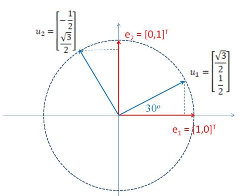

# Linear Algebra Revision Lecture 4

## Eigenvectors and Eigenvalues in $\R^N$ 

If we have an $N\times N$ matrix $\bf A$, the vector $\vec{v} \in \R^N$ is an eigenvector of $\bf A$ with an eigenvalue $\lambda \in \R \text{ if } \vec{v} \neq 0$ and 

$$\textbf{A}\vec{v} = \lambda\vec{v}$$

Note:

-  $\vec{v}$ and $\textbf{A}\vec{v} = \lambda\vec{v}$ point in the same direction
-  A scalar multiple of $\vec{v}$ is also an eigenvector of $\bf A$. Therefore, we often refer to an *eigenspace* and choose $\vec{v}$ to be the unit vector that defines the space, i.e. assume $\|\vec{v}\| = 1$ 

Not all matrices have **real** eigenvectors, such as rotation matrices. Complex eigenvectors do exist but are outside the scope of this module.

### Simple Example

The simplest case of a matrix with eigenvectors is the diagonal real-valued matrix.

Let $\textbf{D} = \begin{bmatrix}
7& 0 \\    0 & 4 
\end{bmatrix}$ then the eigenvectors of $\bf D$ are: 

$$
\vec{e_1}= \begin{bmatrix}
1 \\ 0    
\end{bmatrix} \text{, with eigenvalue } \lambda_1 = 7 \text{, and,}
$$
$$
\vec{e_2} = \begin{bmatrix}
0 \\ 1     
\end{bmatrix} \text{, with eigenvalue } \lambda_2 = 4 
$$

### More Complex Example

Let $\bf R$ be the rotation matrix $\begin{bmatrix}
\frac{\sqrt{4}}{2} & -\frac{1}{2} \\ 
\frac{1}{2} & \frac{\sqrt{3}}{2}
\end{bmatrix}$

We know that $\bf$ is orthogonal and transforms the standard basis $\vec{e_2},\vec{e_2}$ to a new basis:

$$
\vec{u_1} = \begin{bmatrix}
\frac{\sqrt{3}}{2} \\ \frac{1}{2}    
\end{bmatrix},\vec{u_2} = \begin{bmatrix}
    -\frac{1}{2} \\ \frac{\sqrt{3}}{2}
\end{bmatrix}
$$

