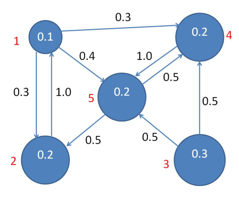
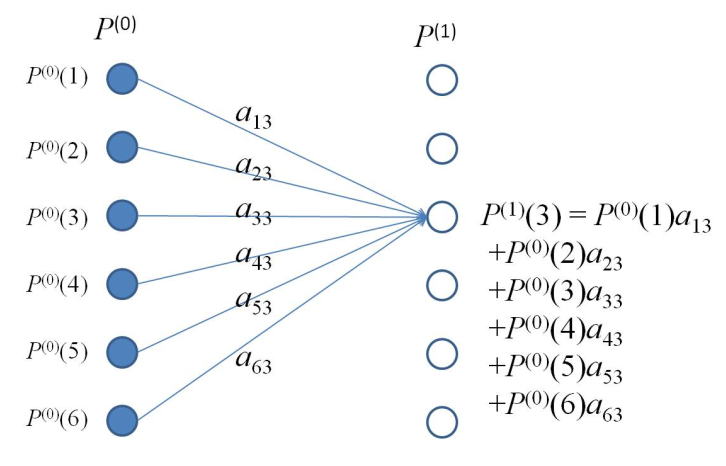

# Lecture 11: Page Rank

Previously, we have only had one metric for whether a document $d$ is a good fit for a query $q$, that was $sim(q,d)$. However in cases of huge document corpuses, there may be too may values of $d$ for which $sim(q,d)$ is large. 

One assumption that must be broken to tackle this problem is that all documents are equal, they are not. Wikipedia is more likely to answer your query than one's personal web page.

**Note: Page Rank is named after Google's Larry Page <u>not</u> web *page***

We assign a prior probability $P(d)$ to each document $d$ in our corpus. We can think of $P(d)$ as the probability that $d$ is relevant to $q$ **before** the user creates query $q$. 
Whether $d$ is returned in response to query $q$ depends on $sim(q,d)$ and $P(d)$. We treat $P(d)$ as the Page Rank of $d$ 

Cases where document retrieval is based solely on $sim(q,d)$ we effectively assume $P(d)$ to be the same $\forall d$. This case is referred to as *equal priors*

## Constructing Priors

We can change our relevance assumption to be that the relevance of any document ot a query is related to how often that document is accessed.

Such as comparing academic papers by their citation index. This is an example of a self-evaluating group whereby each member evaluates all other group members.

<!-- missing info-->

## Definition of a Markov Model

A $N$-state Markov Model consists of:

- A set of $N$ states $\{\sigma_1,\ldots,\sigma_N\}$
- An initial state probability distribution

$$
P_0 = \begin{bmatrix}
    P_0(1) \\ P_0(2) \\ \vdots \\ P_0(N)
\end{bmatrix}
    $$

where $P_0(n)$ is the probability that the model starts in state $n$ and $ \sum_{n=1}^{N}P_0(n) =1 $

- A $N \times N$ state transition probability matrix, $A$, where $a_{ij}$ is the probability of a transition from state $i$ to state $j$ at time $t$

$$
A = \begin{bmatrix}
a_{11} & a_{12} & \cdots & a_{1j} & \cdots & a_{1N} \\
\vdots & \vdots & \vdots & \vdots & \vdots & \vdots \\
a_{i1} & a_{i2} & \cdots & a_{ij} & \cdots & a_{iN} \\
\vdots & \vdots & \vdots & \vdots & \vdots & \vdots \\
a_{N1} & a_{N2} & \cdots & a_{Nj} & \cdots & a_{NN}
\end{bmatrix}
$$

where 

$$
\sum_{n=1}^{N} a_{in} = 1, \forall i =1,\ldots,N
$$

From the initial state probability distribution and the state transition matrix, you can draw a Transition Diagram such as:

## State probability distribution at time $t$

The state probability distribution at time $t=0$ is $P_0$, similarly, at time $t=1$ the PD is $P_1$.

What happens at time $P_t$ in general and what happens as $t\rightarrow \infin$ 

In order to calculate th state probability distribution at time 1, you must calculate and sum the probability of being at each state given a previous (or starting) state. The starting state could be any state. Diagrammatically this can be seen:

In matrix form this can be written: 

$$
P_1 = A^T P_0
$$

and more generally,

$$
P_t = A^TP_{t-1} = A^TA^TP_{t-2} = \cdots = (A^T)^tP_0
$$

Suppose that $P_t \rightarrow P$ as $t \rightarrow \infin$ or the probability distribution plateaus over time, then:

$$
P = A^TP
$$

or, $P$ is an **eigenvector** of $A^T$ with an eigenvalue of 1

## Analysis

Interestingly, we can encode an *'exit'* state into our initial state probability distribution, by definining an initial spd as :

$$
P_0 = \begin{bmatrix}
    0.6 \\ 0.2 \\ 0.2 \\0 
\end{bmatrix}
$$

with a corresponding transition matrix. Our state probability distribution will converge to:

$$
P_{t\rightarrow\infin} \begin{bmatrix}
    0 \\ 0 \\ 0 \\ 1
\end{bmatrix}
$$

## Convergence

Do our state probability distributions always converge as $t \rightarrow \infin$? not

### Conditions for convergence of Markov Processes

**Note not expected to be known**

1. The model must be irreducible, i.e. for every pair of states $s_0, s_1$ there must be a time $t$ and a state sequence $x_1,x_2,\ldots,x_t$ with $s_0 = x_1, s_1 = x_t$ and $P(x_1,x_2,\ldots,x_t) > 0 $. Essentially, it is possible to get from state $s_0$ to $s_1$ via the state sequence $x_1,x_2,\ldots,x_t$ with a non-zero probability.
2. The model must be *aperiodic*, a state is aperiodic if the HCF of the set of return times for the state must be 1. A model is aperiodic if all of its states are aperiodic. 

## Simplified Page Rank

Given a set of documents $D = \{ d_1,\ldots,d_N\}$ we define:

- $pa(n)$ as the set of pages pointing to $d_n$
- $h_n$ as the number f hyperlinks from $d_n$

With this the simplified Page rank $x_n$ for document $d_n$ is given by:

$$
x_n = \sum_{d_m\in pa(n)} \frac{x_m}{h_m}
$$

As this equation is recursive we instead write:

$$
x_n^{i+1} = \sum_{d_m \in pa(n)}\frac{x_m{(i)}}{h_m}
$$

We can formulate this in matrix form:

Let $\bf W$ be the $N \times N$ matrix whose $(m,n)^{th}$ entry is given by:

$$
w_{m,n} = \begin{cases}
\frac{1}{h_n}  & \text{if there is a hyperlink from } x_n \text{ to } x_m \\
0 & \text{otherwise}
\end{cases}
$$

Let $x_i$ be the $N\times 1$ column vector whose $n^{th}$ entry is $x_{i_n}$ then:

$$
x_{i+1} = \textbf{W}x_i
$$

We can therefore define:
$$
\textbf{W}\vec{x_{i}} = \begin{bmatrix}
    \frac{1}{h_1} & \frac{1}{h_2} & 0 & \dots & \frac{1}{h_n} & \dots & \frac{1}{h_N} \\
    0 & \frac{1}{h_2} & \frac{1}{h_3} & \dots & \frac{1}{h_n} & \dots & \frac{1}{h_N} \\ 
    \vdots &\vdots &\vdots &\vdots &\vdots &\vdots &\vdots \\
    \frac{1}{h_1} & \frac{1}{h_2} & \frac{1}{h_3} & \dots & \frac{1}{h_n} & \dots & \frac{1}{h_N}
\end{bmatrix}\cdot 
\begin{bmatrix}
    x_{1_i} \\
    x_{2_i} \\
    x_{3_i} \\
    \vdots \\ 
    x_{N_i} \\
\end{bmatrix}
$$

### Simplified Page Rank: Markov model interpretation

We can implement Simplified Page Rank using a Markov model where:

$$
P_0 = x_0
$$
$$
A = \textbf{W}^T
$$

I.e. $P_0$ is the initial estimate of Page Rank, $\bf W$ is the transpose of the state transition probability matrix $\bf A$ 

$\bf A = w^T$ means that $P_t = \textbf{W}P_{t-1}$ 

### *"Damping Factor"* 

To this point all authority $x_n$ of a page $d_n$ comes from the pages that have hyperlinks to it. I.e. a page with no hyperlinks to it will have an authority of 0. This breaks with the first requirement for Markov convergence, irreducibility. 
To solve this problem, we introduce a *damping factor* $d \in \R, 0 < d < 1$. Where $d$ os the proportion of authority that a page *gets* by default. 

Our simplified Page rank equation now becomes: 

$$
x_{i+1} = (1-d)\textbf{W}x_i + \frac{(d)}{N}1_N
$$

Where $1_N = \begin{bmatrix}
   1 \\ 1 \\ \vdots \\ 1 
\end{bmatrix}$ is a $N\times 1$ column vector of 1s 

### Convergence 

$x = (1-d)\textbf{W}x + \frac{d}{N}1_N$

is a system of $N$ equations with $N$ unknowns. We can re-write this as a dynamic system:

$$
x_{t+1} = (1-d)\textbf{W}x_t + \frac{d}{N}1_N 
$$

When considered in this way we can see that it converges for any initial condition $x_0$ to a unique fixed point $x^*$ s.t.

$$
x^* = (1-d)\textbf{W}x^* + \frac{d}{N}1_N
$$

### Dangling Pages

A page which contains no hyperlinks to other pages is referred to as a **dangling page** as in a tree-based representation they form the leaf nodes. 
If $d_n$ is a dangling page the the $n^{th}$ column of $\bf W$ consists of entirely 0s. $\therefore$ the sum of the $n^{th}$ column sums to 0 and $\bf W$ is no longer a column stochastic matrix. Cases such as these can break some of our earlier analysis.

One solution to dangling pages is to introduce a *dummy* page $d_{N+1}$ and add a link to $d_{N+1}$ to every previously dangling page. 
We then extend our transition matrix to get a new $(N+1) \times (N+1)$ matrix $\bf W$ and create a new *dangling page indicator* $\vec{r} = \{r_1,r_2,\ldots,r_N\}$ where:

$$
r_n = \begin{cases}
   1 & \text{if } d_n \text{ is a dangling page} \\ 
   0 & \text{otherwise}
\end{cases}
$$

We add $\vec{r}$ as the bottom row of $\bf W$ and add an additional column of $N$ 0s followed by a single 1 so that our new transition matrix $\bf \bar{W}$ becomes:

$$
\mathbf{\bar{W}} = \begin{bmatrix}
    \frac{1}{h_1} & \frac{1}{h_2} & 0 & \dots & 0 & \dots & \frac{1}{h_N} & 0 \\ 
    0 &  \frac{1}{h_2} & \frac{1}{h_3} & \dots & 0 & \dots & \frac{1}{h_N} & 0 \\ 
    \frac{1}{h_1} &  0 & \frac{1}{h_3} & \dots & 0 & \dots & \frac{1}{h_N} & 0 \\ 
    \vdots &\vdots &\vdots &\vdots &\vdots &\vdots & \vdots & 0 \\
    \frac{1}{h_1} &  \frac{1}{h_2} & \frac{1}{h_3} & \dots & 0 & \dots & \frac{1}{h_N} & 0 \\ 
    0 & 0 & 0 & \dots & 1 & 0 & 0 & 1
\end{bmatrix}
$$

Here you can see that each dangling page has a hyperlink to $d_{N+1}$ and $d_{N+1}$ has only a link to itself. 

An alternative solution is to create links from dangling pages to **all** pages. Here we construct a $N\times N$ matrix $\bf V$ with $N$ equal rows $\frac{\vec{r}}{N}$

Finally we construct an $N\times N$ matrix of $\bf (W+V)$ of the form: 

$$
\mathbf{V + W} = \begin{bmatrix}
    \frac{1}{h_1} & \frac{1}{h_2} & 0 & \dots & \frac{1}{N} & \dots & \frac{1}{h_N} \\ 
    0 & \frac{1}{h_2} & \frac{1}{h_3} & \dots & \frac{1}{N} & \dots & \frac{1}{h_N} \\ 
    \frac{1}{h_1} & 0 & \frac{1}{h_3} & \dots & \frac{1}{N} & \dots & \frac{1}{h_N} \\ 
    \vdots & \vdots & \vdots & \vdots & \vdots & \vdots & \vdots & \\ 
    \frac{1}{h_1} & \frac{1}{h_2} & \frac{1}{h_3} & \dots & \frac{1}{N} & \dots & \frac{1}{h_N}
\end{bmatrix}
$$

With this new transition matrix our page rank equation becomes: 

$$
x = (1-d)(\mathbf{W+V})x+ \frac{d}{N}1_N
$$

## Probabilistic Interpretation of Page Rank 

We can essentially think of each page as a state in a Markov model or a node in a graph. Each note or state is connected via a hyperlink structure. Each Connection between a node $p$ and $q$ is weighted by the probability of its usage. These weights depend only on the current node, not on the path to it; this is a property of Markov decision chains. 

