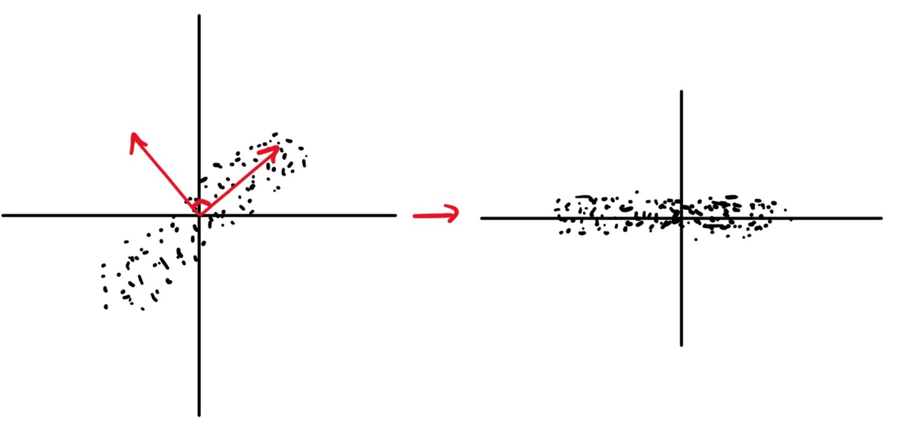

# Lecture 5:  Principal Components Analysis

## Covariance: A Reminder

The sample covariance for $X$ between the $i^{th}$ and $j^{th}$ coordinates is given by:
$$
\sigma^{ij} = \frac{1}{N-1}\sum_{n=1}^{N}(\mu^i - x_n^i)(\mu^j - x_n^j)
$$

Where $\mu$ is the sample mean $= \frac{1}{N}\sum_{n=1}^{N}x_n$

The sample covariance is usually represented as a $D \times D$ **real symmetric** matrix $\Sigma$ 

$$
\Sigma = \begin{bmatrix}
    \sigma^{1 1} & \sigma^{12} &\cdots & \sigma^{1D} \\
    \sigma^{21} & \sigma^{22} & \cdots & \sigma^{2D} \\
    \vdots & \vdots &\ddots & \vdots \\ 
    \sigma^{D1} & \sigma^{D2} & \cdots & \sigma^{DD}
\end{bmatrix}
$$

## Motivation

The two datasets shown in the figure above, in red and black, have an equal variance in both the $x$ and the $y$ direction, They also have the same mean but clearly have different correlation.

Conversely here we see data with the same shape but different covariance, with the LHS having positive covariance and the RHS having zero covariance. The data on the RHS is *nicer* in so far as the properties of the data are clearer. This is obvious when looking a the RHS data but not so for the LHS, however, if we were to interpret the LHS using a different basis *(marked in red)* we could represent it as the same as the RHS. With our data in the form of the RHS, we can see that our dataset is essentially a 1D set with noise in the $2^{nd}$ dimension.

## Overview

How do we find the axis that are best at representing the space? The aim of Principal Component Analysis is to answer this.

We begin by finding the axis that describes the direction of maximum variation in the data, shown as $\vec{u}$ in the above figure.
To find this we start with a potential value for $\vec{u}$ and:

- Project data onto $\vec{u}$ 
- Calculate the variance of the data in the direction of $\vec{u}$ 
- Maximise the variance with respect to $\|\vec{u}\| = 1 $ 

An issue with this is that $\vec{u}$ **must** be a unit vector. This gives us, essentially, a constrained optimisation problem. We can solve this using  *Lagrange Multipliers* which are outside the scope of this module.

However, we know that the solution to such a problem is that $\vec{u}$ is the eigenvector of the covariance matrix corresponding to the largest eigenvalue. 
The eigenvector of the next largest eigenvalue corresponds to the direction of the next biggest variation and so on.

The eigenvalue shows the variation in the direction of the corresponding eigenvector.

Principal Components Analysis is a tool to reveal the structure of a dataset $X \in \R^N$ 

To carry out PCA, apply eigenvector decomposition to a covariance matrix $C \in X$ 

$$
C = UDU^T
$$

Where $D$ is a diagonal matrix $\in R^+$ and $U$ is an orthogonal matrix
The columns of $U$ are a **new basis** $\{u_1,\ldots,u_N\}$ for $\R^N$. Basis vectors $u_n$ point in directions of maximum variance of $X$
The eigenvalues $\in D$ $d_n$ is the variance of the data in the direction of $u_n$ 

## PCA Pictorially

 1. Centre data around the origin *(error in digram)*, by calculating the mean and subtracting from each datapoint 
 2. a. Calculate covariance matrix, $C$
     b. Perform eigenvector decomposition to $C$, vectors in diagram show resulting eigenvectors
 3. Plot data with respect to new coordinate system, resulting plot has 0 covariance.
 4. (Optional) Normalise out the variance to transform data into gaussian plot

