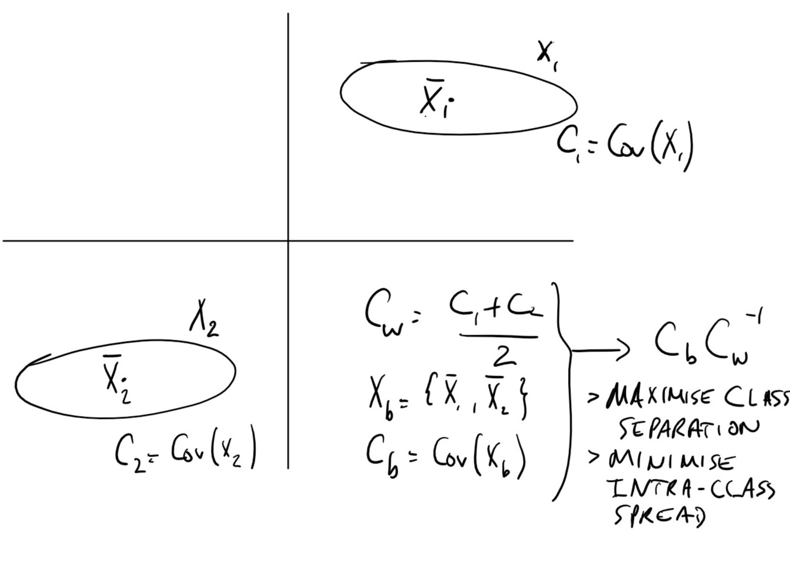
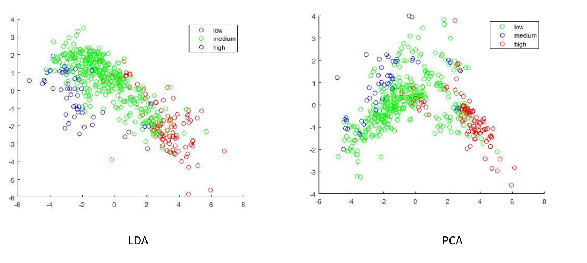

# Lecture : Linear Discriminant Analysis

## PCA vs LDA

Principal Components Analysis finds the *direction of maximum variance* for a dataset $X$. 
If each datapoint $x \in X$ falls into one of a distinct number of classes $c_i \in C$ , PCA does not utilise this information to better separate the data.

## LDA

In this case where we have a dataset $X$ where each point belongs to one of $K$ classes, let $X_k$ be the set of data points in $X$ that belong to the class $c_k$.

$$
X = X_1 \cup X_2 \cup \cdots \cup X_K 
$$

Let $C_K$ be the covariance matrix of the dataset $X_K$, we define the average *within-class covariance matrix* $C_w$ as:

$$
C_w = \frac{C_1 + C_2 + \ldots C_K}{K}
$$

Let $X_b$ be the a $K$ row matrix where the $k^{th}$ row is the average of the vectors in $X_k$. The *between-class covariance matrix* is the covariance matrix $C_b = \text{Cov}(X_b)$

In order to separate the classes we want to find a direction in the vector space that simultaneously:

1) Maximises the between-class variance $C_b$ 
2) Minimises the within-class variance $C_w$ 

The vector that satisfies these requirements is the eigenvector of $C_bC_w^{-1}$ corresponding to the largest eigenvalue.

### Diagrammatic Example

### LDA vs PCA

Here you can see that the split of the data is much more defined using LDA with entire sections being entirely populated by a single class.
