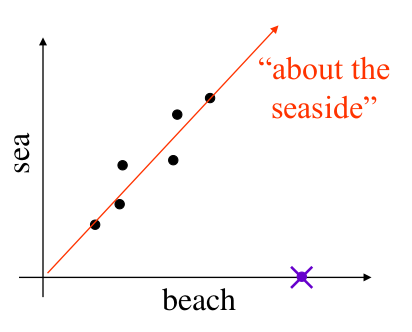

# Lecture 7: Latent Semantic Analysis

## Vector Notation for Documents

Given a set of documents $D= \left\{ d_1, d_2,\ldots,d_N\right\}$, we can consider this a corpus for information retrieval (IR). Suppose the number distinct words in the corpus ($D$) is $V$, this is our vocabulary size.

If we split each document $d \in D$ into $M$ different terms, we can write $d = \left\{ t_{i(1)},t_{i(2)},\ldots,t_{i(M)} \right\}$. Finally, we assign a frequency to each term s.t. term $t_{i(m)}$ occurs $f_{i(m)}$ times.

With this, the vector representation, $\text{vec}(d) = \vec{d}$ of $d$ is the $V$ dimensional vector: 

$$
\left( 0,\ldots, 0, w_{i(1),d}, 0, \ldots, 0, w_{i(2),d}, 0, \ldots, 0, w_{i(M),d}, 0, \ldots, 0 \right)
$$

where: 

- $w_{i(1),d}$ is the weighting calculated from term frequency $\times$ the inverse document frequency, i.e. $= f_{i(1),d} \times IDF(i(1))$ and the $1$ denotes the $i(1)^{th}$  place term.

## Latent Semantic Analysis (LSA)

Suppose we have a corpus with a large number of documents, for each document $d$ the dimension of the $\vec{d}$ is potentially in the thousands.

Suppose one such document contained the words *'sea'* and/or *'beach'*. Intuitively, often, a document contains *'sea'* it will also include *'beach'*.

Mathematically, if $\vec{d}$ has a non-zero entry in the *'sea'* component/ dimension, it will often also have a non-zero entry in the *'beach'* component.

### Latent Semantic Classes

If it is possible for us to detect such structures as the one seen above, then we can start to discover relationships between words automatically, from data.

The above example can be described as an equivalence set of terms including *'beach'* and *'sea'* which is *about the seaside*

Finding such classes is non-trivial and involves some relatively advanced linear algebra; the following is only an outline of which.

#### Steps

1. Construct the *word-document* matrix $\bf A$ 
   The *word-document* matrix is the $N\times V$ matrix whose $n^{th}$ row is the document vector of the $n^{th}$ document in the corpus.

   $$
\begin{bmatrix}
   w_{t_1 d_1} & w_{t_2 d_1} & \cdots & w_{t_m d_1} & \cdots &  w_{t_V d_1} \\ 
   w_{t_1 d_2} & t_{t_2 d_2} &  \cdots&  w_{t_m d_2}&  \cdots & w_{t_V d_2} \\ 
   \vdots & \vdots & \vdots & \vdots &\vdots & \vdots  \\
   w_{t_1 d_n} & t_{t_2 d_n} & \cdots & w_{t_m d_n} & \cdots & w_{t_V d_n} \\
   \vdots & \vdots & \vdots & \vdots &\vdots & \vdots  \\
   w_{t_1 d_N} & w_{t_2 d_N} & \cdots & w_{t_m d_N} & \cdots & w_{t_V d_N}
\end{bmatrix}$$

2. Decompose $\bf A$ using **Singular value decomposition (SVD)** 
   This is a common function found in packages such as matlab or Julia's Linear algebra module.
   This process is similar to that of **eigenvector decomposition**, an eigenvector of a square matrix $\bf A$ is a vector $e$ s.t. $\textbf{A}e = \lambda_e e$ where $\lambda$ is a scalar. 
    For certain formations of $\bf A$ we can write $\bf A = UDU^T$ where $\bf U$ is an **orthogonal matrix** and $\bf D$ is diagonal. 
    - The elements of $\bf D$ are the eigenvalues
    - The columns of $\bf U$ are the eigenvectors 
    One can think of SVD as a more general form of eigenvector decomposition, which works for general matrices

    In SVD we re-write $\bf A$ as $\bf A = USV^T$ 

    $$
\textbf{A} = \begin{bmatrix}
   u_{1,1} & u_{1,2} & \cdots & w_{1,N} \\ 
   w_{2,1} & u_{2,2} & \cdots & u_{2,N} \\ 
   \vdots & \vdots & \vdots & \vdots \\ 
   u_{N,1} & u_{N,2} & \cdots & u_{N,N}
\end{bmatrix} \cdot 
\begin{bmatrix}
   s_1 & 0 & 0 & \cdots & \cdots & 0 \\ 
   0 & s_2 & 0 & \cdots & \cdots & 0 \\ 
   \vdots & \vdots & \cdots & 0 & \vdots & \vdots  \\ 
   0 & 0 & \cdots & s_N & 0 & 0  
\end{bmatrix} \cdot 
\begin{bmatrix}
   v_{1,1} & v_{2,1} & \cdots & v_{m,1} & \cdots & v_{V,1} \\ 
   v_{1,2} & v_{2,2} & \cdots & v_{m,2} & \cdots & v_{V,2} \\ 
   \vdots &\vdots &\vdots &\vdots &\vdots &\vdots \\
   v_{1,n} & v_{2,n} & \cdots & v_{m,n} & \cdots & v_{V,n} \\ 
   \vdots &\vdots &\vdots &\vdots &\vdots &\vdots \\
   v_{1,V} & v_{2,V} & \cdots & v_{m,V} & \cdots & v_{V,V}
\end{bmatrix} $$

### Interpretation

The matrices $\bf U$ and $\bf V$ are orthogonal with real numbered entries.

- $\bf U$ is $N \times N$ where $N$ is the number of documents in the corpus. 
- $\bf V$ is $V\times V$ where $V$ is the vocabulary size 
  - They satisfy: $\bf UU^T = I = U^TU, VV^T = I = V^TV$
- The singular values $s_1, \ldots, s_N$ are positive and satisfy $s_1 \geq s_2 \geq \ldots \geq s_N$
  - The off-diagonal values of $\bf S$ are all 0 

The columns of $\bf V$ are $V$ dimensional unit vectors orthogonal to each other. They form a new **orthonormal basis** for the document vector space. Each column of $\bf V$ is a document vector corresponding to a semantic class, or topic, in the corpus. The importance of the topic $v_n$ is given by the magnitude of $s_n$ 

As $v_n$ is a document vector, its $j^{th}$ value corresponds to the TF-IDF weight for the $j^{th}$ term in the vocabulary for the corresponding document or topic. Using this we can work out how important to a topic the $j^{th}$ term in a document vector is to a topic $v_n$. If $v_{n,j}$ is large then it plays an important role in the topic. 

While $\bf V$ describes topics as combinations of terms/ words, $\bf U$ describes topics as a combination of documents. 

### Topic-based representations 

The columns of $\bf V$ , $v_1, \ldots, v_V$ are an orthonormal basis for the document vector space. 

If $d$ is a document in the corpus then $\vec{d}\cdot v_n$ is the magnitude of the component of $\vec{d}$ in the direction of $v_n$, i.e. the component of $\vec{d}$ corresponding to topic $n$. Therefore, it follows that:

$$
top(d) = \begin{bmatrix}
   \vec{d}\cdot v_1 \\  
   \vec{d} \cdot v_2 \\
   \vdots \\ 
   \vec{d}\cdot v_n \\ 
   \vdots \\ 
   \vec{d}\cdot v_V 
\end{bmatrix}
$$

is a topic-based representation of $d$ in terms of $v_1,\ldots,v_V$ 

#### Topic-Based dimension reduction

Since the singular values $s_n$ indicate the importance of the topic $v_n$, we can therefore, truncate the vector $top(d)$ when $s_n$ becomes *small* or insignificant.

$$
top(d) \approx \begin{bmatrix}
   \vec{d}\cdot v_1 \\
   \vec{d}\cdot v_2 \\
   \vdots \\
   \vec{d}\cdot v_n  
\end{bmatrix} = \textbf{V}_{(n)}^T vec(d)
$$

where $\bf V_{(n)}$ is the $V\times n$ matrix comprised of the first $n$ columns of $\bf V$ 
We can now say that $top(d)$ is a reduced $(n)$ dimensional vector representation of the document $d$ 

## Topic based word representation

Suppose $w$ is the $i^{th}$ word or term in the vocabulary. 

The *one-hot* vector $h(w)$ is the vector:

$$
h(w) = \begin{bmatrix}
   0 \\ 
   \vdots \\
   0 \\
   1 \\ 
   0 \\
   \vdots \\
   0
\end{bmatrix}
$$

**Note: a *one-hot* vector is a vector where only one row has a non-zero value.**

$h(w)$ is essentially the document vector for a document consisting of just the word $w$  

We can use $h(w)$ to find the vector $top(w)$ that describes $w$ in terms of the topics that it contributes to:

$$
top(w) = \begin{bmatrix}
h(w) \cdot v_1 \\
h(w) \cdot v_2 \\
\vdots \\ 
h(w) \cdot v_n \\
\end{bmatrix} = \textbf{V}_{(n)}^T top(w)
$$

Where $\textbf{V}_{(n)}$ is the $V\times n$ matrix comprised of the first $n$ columns of $\bf V$ 

Intuitively, given two synonymous we would expect that they would contribute similarly to similar topics, and as such we would expect $top(w_1)$ and $top(w_2)$ to point in similar directions. $top(w)$ is often referred to as a **word embedding**
