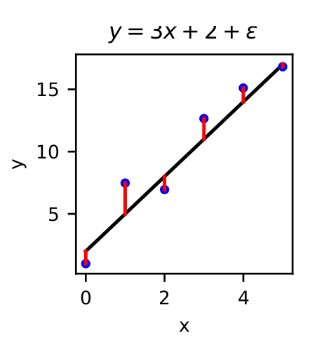

# Lecture 1

## Regression

- The task of finding the relationship *(mathematical function)* between one or more numerical inputs *(independent variables)* and one or more numerical outputs *(dependent variables)*

- Curve fitting
  - Given a set of points, try ot learn a function to describe them
  - Given a value $x$, we can predict the corresponding value $y$
  - Not just for straight line fitting

### Simple example

Let us consider a simple *linear* example with 1 independent variable, $x$ & 1 dependent variable, $y$

###### (1)

$$\mathcal{D} = \{(x_1,y_1),...,(x_n,y_n)\} = \{(x_i,y_i)\}_{i=1}^N$$

Model the relationship between $x$ and $y$ with the function $f(\textbf{w},x)$, s.t $y_i \approx f(\textbf{w},x_i)$
Measurements of $y$, subject ot noise are defined by,

###### (2)

$$y_i = f(\textbf{w},x_i) + \epsilon$$

Where $\epsilon$ is a random number drawn from some continuous probability density function.
Goal is to find some $\textbf{w}$ that solves, or provides the best approximation to the above equation.

First, let us approach this as a optimisation problem in which the objective is to find the value of **w** (denoted **w***) that minimises some *loss* or objective function $L(\textbf{w})$

###### (3)

$$\textbf{w}* = \argmin_w L(\textbf{w}) $$

Intuitively, $L(\textbf{w})$ should be designed to capture the difference between the data and the predictions of the model, and seek to minimise this. 
One common choice for $L(\textbf{w})$ is *least-squares error*. Given our dataset $D$ and modelling function $f(\textbf{w},x)$, we construct $\forall d \in \mathcal{D}$ a residual error defined as:

###### (4)

$$ r_i(\textbf{w}) = y_i - f(\textbf{w}, x_i)$$

<!--  -->

The least squares error *(LSE)* loss function is defined in terms of residuals as:

###### (5)

$$ L_{LSE}(\textbf{w}) = \sum_{i=1}^N r_i^2 = \textbf{r}^T\textbf{r} $$

It is important to note that the above definition implicitly has no upper bound but is restricted to being strictly posive, thus, allowing us to find a minimum value.

###### (6)

$$\textbf{w}^* = \argmin_\textbf{w} L_{LSE}(\textbf{w})$$

Optimisation is a very difficult problem to solve and so, for now, we resitct ourselves to a specifically *linear* case. 

**N.B. when we say *linear* we do not reference the problem being of the form "$y = mx + c$" but instead that our problem is linear in it's *unknown parameters***

Linear models take the form: 

###### (7)

$$f(\textbf{w},x) = w_0\phi_0(x) + \cdots + w_{M-1}\phi_{M-1}(x) = \sum_{i=0}^{M-1} w_i\phi_i(x)$$ 

Our function is a *linear combination* of a set of *basis functions*, $\{\phi_i(x) \}_{i=0}^{M-1}$ weighted by our free parameters $\{w_i\}_{i=0}^{M-1}$.

A common choice of basis function is the polynomials $\{x^i\}_{i=0}^{M-1}$

For a finite set of data points $\mathcal{D}$ we can re-write the equation for $f(\textbf{w},x)$ in matrix form by defining a matrix **$\Phi$** with components $\Phi_{ij} = \phi_j(x_i)$ which yields the equation:

###### (8)

**$$f(w) = \Phi w$$**

Where the variable $x$ is swallowed by the construction of **$\Phi$** in **$f$**

#### Example $\Phi$ Construction 

For a simple quadratic model $f(\textbf{w},x) = w_0 + w_1x+ w_2x^2$ with basis functions $\{x^0,x^1,x^2\} = \{1,x,x^2\}$, we construct: 

###### (9)

$$\boldsymbol{\Phi} = 
\begin{pmatrix} 
1 & x_1 & x_1^2  \\
1 & x_2 & x_2^2  \\
\vdots & \vdots & \vdots \\
1 & x_N & x_N^2
\end{pmatrix}$$

We can now begin to solve our [equation here](#3). The residuals [defined here](#4) can be written as:

###### (10)

**$$r = y - \Phi w$$** 

And our [loss function](#6), becomes:

###### (11)

$$L_{LSE}(\textbf{w}) = (\textbf{y}-\boldsymbol{\Phi}\textbf{w})^T(\textbf{y}-\boldsymbol{\Phi}\textbf{w})$$

As we have observed, $L_{LSE}$ has no upper bound but does have a lower bound. To minimise $L_{LSE}$ we find the point at which $L_{LSE}' = 0$ where $L_{LSE}'$ is it's first derivative with respect to it's free parameters. 

If we differentiate $L_{LSE}$ with respect to $\textbf{w}$ we get:

###### (12)

$$\frac{\delta L_{LSE}(\textbf{w})}{\delta \textbf{w}} = -2 \boldsymbol{\Phi}^T(\textbf{y} - \boldsymbol{\Phi}\textbf{w})$$

**For a proof of this, see Iain Styles' Notes**

Setting this result to 0 we obtain: 

###### (13) 

$$\boldsymbol{\Phi}^T\textbf{y} - \boldsymbol{\Phi}^T\boldsymbol{\Phi}\textbf{w}^*=0$$

This is known as the **normal equations** and are a set of simultaneous linear equations which we can solve for $\textbf{w}^*$

**These notes were heavily influenced by those of Dr. Iain Styles, University of Birmingham, School of Computer Science*