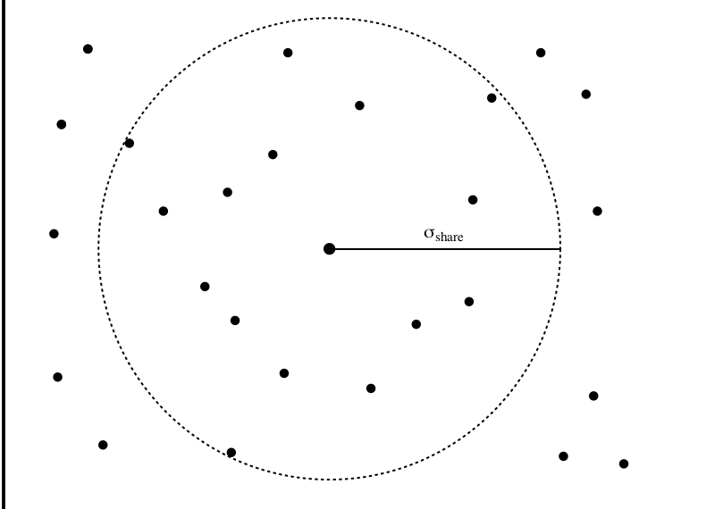

# Lecture 11: Niching and Specification

## Niching

A niche refers to the formation of groups of individuals in a population. Individuals in these groups are similar.

This is useful in maintaining population diversity, allowing better exploration of the search space. 
It is also useful for:

- Optimising multiple objectives simultaneously
- Learning an ensemble of systems that cooperate 
- Simulating complex and adaptive systems such as artificial ecological systems.

There are different techniques for niching including (fitness) sharing and crowding.

### Fitness Sharing 

Initially introduced by Goldberg adn Richardson in 1987. It alters only the fitness assignment stage of a GA, it must be the last applied before selection. 

Fitness sharing transforms the fitness of an individual into a shared group fitness. It relies on the idea that fitness is a finite resource within each niche. 

Essentially, the number of individuals residing near a given peak will be proportional to the height of that peak.

#### Sharing radius

**Sharing radius** $\sigma_{\text{share}}$ defines the niche size. Individuals within this radius will be regarded as being similar to eachother, $\therefore$ needing to share fitness.
The similarity between two individuals is dependant on the distance between them. The similarity between two binary strings can be defined by their **Hamming distance**.

#### Sharing Function and Shared Fitness

The sharing function can be defined as:

$$
sh(d_{ij}) = \begin{cases}
1 - \left( \frac{d_{ij}}{\sigma_{\text{share}}} \right)^\alpha , & \text{if } d_{ij} < \sigma_{\text{share}}, \\ 
0,    & \text{otherwise}
\end{cases}
$$

where $d_{ij}$ is the distance between individuals $i$ and $j$ 
$\alpha$ determines how *sharp* or *smooth* the edge of the sharing radius is. As $\alpha \rightarrow \infin$ the edge gets more blurred as $sh(d_{ij}) \rightarrow 1$

$\sigma_{\text{share}}$ is set to a value small enough to allow discrimination between desired peaks.

The shared fitness of individual $i$ can be defined as:

$$
f_{\text{share}}(i) = \frac{f_{\text{raw}}(i)}{\sum_{j=1}^{\mu}sh(d_{ij})}
$$

where $\mu$ is the population size

Population size can be set roughly as a multiple of the number of peaks the user wishes to locate. Sharing is best run for a number of generations, often recommended around $\log\mu$. This heuristic comes from shortening the expected convergence time of a GA that uses fitness-proportionate selection.  

Sharing can be done at the genotypic or phenotypic levels. 
At the genotypic level use the hamming distance to distinguish individuals. This approach is typically applied as a last resort when there is no phenotypic option available.

At the phenotypic level the distance function $d$ is defined using problem-specific knowledge of the phenotype. For a set of $k$ variables, the most common function is the **euclidean distance**. However, for a classification problem the distance between two rules can be defined based upon the examples to which they both apply. 

**Note: A GA under fitness sharing will not converge individuals to the tops of the peaks it locates** Instead run another algorithm such as hill climbing afterwards.

Fitness sharing can be implemented with any selection method, however the choice may affect the stability of the algorithm.

The major drawback of fitness sharing is the additional time required to iterate over the population to compute the shared fitness. 

##### Fitness Scaling in Sharing

In order for fitness sharing to work, *raw* fitness scaling is often required, defined as followed:

$$
f_{\text{share}} = \frac{f_{\text{raw}(i)^\beta}}{\sum_{j=1}^{\mu}sh(d_{ij})}
$$

where $\beta>1$ is a scaling factor

However, this approach has issues:

1. With a low scaling factor individuals will not converge to the optimal as they are no attractive
2. WIth a high scaling factor, *super individuals* will dominate the initial populations and the process may not find all peaks.

Solutions include:

- Using a large population
- *soft selection* 
- Anneal $\beta$, i.e. from a starting value, slowly increase.

#### Implicit Fitness Sharing

The idea for implicit fitness sharing stems from the immune system, the antibody that best matches the invading antigen receives the *payoff*

##### Algorithm

For each test case $i$ to be solve do the following $C$ times:

1. select sample of $\sigma$  individuals
2. Find the individual in the sample that achieves the best performance for solving $i$
3. This individual will receive the payoff. In the case of ties, reward is split evenly between candidates. 

###### Discussion

It has been shown that, theoretically , implicit and explicit fitness sharing share the same basis. A larger value for $C$ leads to better performance but longer run-time.

##### Comparison 

Implicit fitness sharing covers optima more comprehensively even in cases where the population size allows for entire species to form at each optimum.

Explicit fitness sharing is able to find optima where the population size is not great enough to cover all optima.

**Note:** There is technically a distinction between niching and speciation. Niching is concerned with locating peaks in a search space whereas speciation is more focused on converging to the peaks.

## Summary

1. Niching enables us to find multiple peaks simultaneously using an EA. 
2. Niching techniques are not *"one size fits all"* with each occupying its own *Niche*
3. **ALL** fitness sharing techniques transform fitness values of individuals
4. Population size is an important parameter in EAs where fitness sharing is used.

