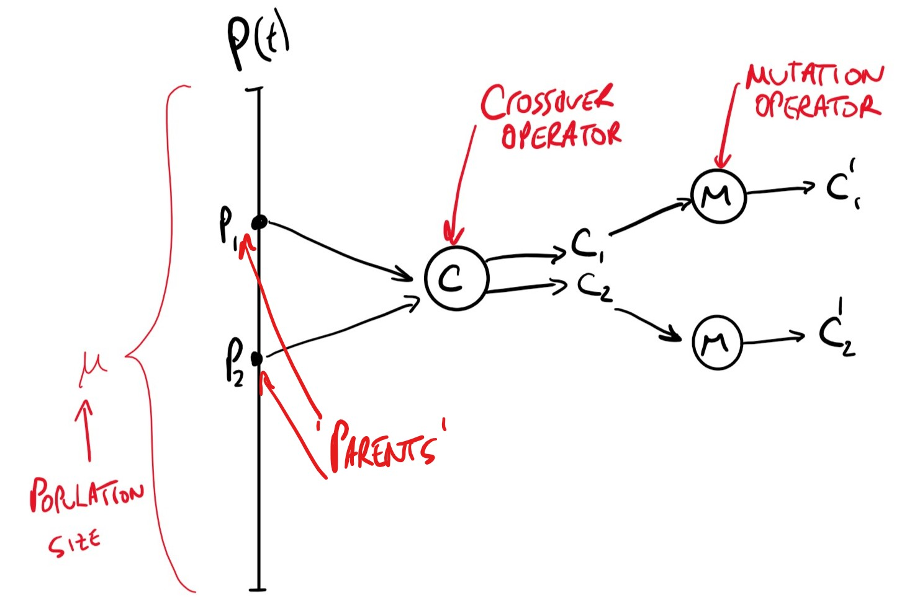

# Lecture 12: Crowding

Using fitness sharing we encouraged diversity in our population. It works by changing the raw fitness of individuals. Explicit fitness sharing relies on a similarity or distance metric whereas implicit fitness sharing does not use a similarity measure. 

## What is Crowding?

Crowding techniques add new individuals to a population by replacing similar individuals. Their purpose is to maintain $\approx$ the same diversity in a population. **They do not modify fitness**

### Deterministic Crowding

#### Algorithm

```python
P(0) <- Initialise
for t = 1 to g:
    P(t) <- shuffle(P(t-1))
    for i = 0 to mu/2 -1:
        p_1 <- a_2i+1(t)
        p_2 <- 2_2i+2(t)
        {c_1,c_2} <- recombine(p_1,p_2)
        c_1' <- mutate(c_1)
        c_2' <- mutate(c_2)
        if [d(p_1,c_1') + d(p_2,c_2')] <= [d(p_1,c_2') + d(p_2,c_1')]:
            if f(c_1') > f(p_1):
                a_2i+1(t) <- c_1'
            if f(c_2') > f(p_2):
                a_2i+2(t) <- c_2'
        else 
            if f(c_2') > f(p_1):
                a_2i+1(t) <- c_2' 
            if f(c_1') > f(p_2):
                a_2i+2(t) <- c_1'        
```
This is quite a confusing algorithm to read, the following image depicts the lines up to the first `if` statement



whereby 2 random parents are chosen and put through crossover and mutation. 

The final if-else statements determine whether or not the new children replace the parents in the population based on their fitness and distance values.

This approach is capable of niching, i.e. locating and maintaining peaks. It also has minimal replacement error meaning it rarely replaces an individual from one class with one from another.
There are few parameters to tune and is fast as there ar eno distance calulations.
However, it can only be used on populations with enough individuals. It must also be used in conjunction with full crossover (*crossover rate = 1.0*)

## Speciation 

Speciation (*in a narrow sense*) focuses search within a peak. A speciation method restricts mating to being between similar individuals (of the same *species*). To apply such an operator we need a method of separating a population into species classes. Niching and speciation are complementary and similarity can be measured at either the genotypic or phenotypic level.

How do we restrict our mating to intra-species? 

### Use Tags

In this method each individual has a tag and functional string.

| template | tag   | functional string                 |
| -------- | ----- | --------------------------------- |
| # 1 # 0  | 10010 | 1010 $\ldots$        $\ldots$ 101 |

These tags are used in crossover and mutation but not in fitness evaluation. This approach has been shown as effective for multi-modal function optimisation. 

Here, only individuals with the same tag are allowed to mate.

### Use Distance

In this approach we define a threshold parameter, $\sigma_{\text{mate}}$. Two individuals are allowed to mate only when their distance is smaller than $\sigma_{\text{mate}}$ 

However this introduces an expensive calculation of distance 

## Fitness Sharing by Speciation

If you were to use the tagging approach above, for a given problem, let $k$ be the number of different tags. Let $\{S_o,S_1,\ldots,S_{k-1}\}$ be $k$ species of individuals and $\|\cdot\|$ be the cardinality of that set. Then: 

$$
f_i^{\text{share}} = \frac{f_i^{\text{raw}}}{\|S_j\|}, i \in S_j, j=0,1,\ldots, k-1
$$

Recombination of individuals occurs only where they share a tag. The tag itself is also able to be mutated, notice in this approach no distance metric is used. This approach effectively combines fitness sharing and mating restriction.

## Summary 

Fitness sharing modifies the fitness of individuals in the population. We have seen 3 different approaches:

1. Explicit fitness sharing
2. Implicit fitness sharing
3. Fitness sharing with mating restriction

Crowding concerned with pop replacement strategies, we have looked specifically at deterministic crowding.

Speciation, basically, occurs during the recombination  process. It is concerned with mating restriction either by tags or by distance. 

