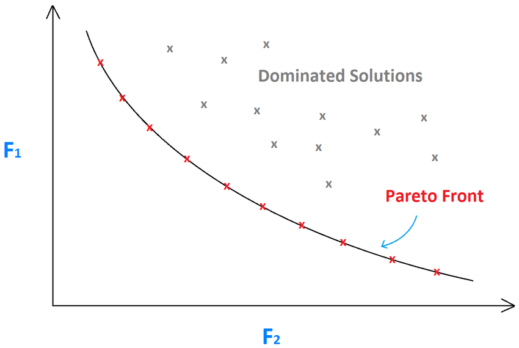

# Lecture 13: Multi-Objective Optimisation

Often we encounter problems that have multiple objectives which we would like to maximise/ minimise. For example, buying a car, we may have many things that we are looking to maximise whilst also minimising the price such as number of seats or comfort.

## How do we determine which solutions are optimal?

### Domination

$ x^{(1)} $ dominates $ x^{(2)} $ if it satisfies both:

1. $ x^{(1)} $ is no worse than $ x^{(2)} $ in all objectives
2. $ x^{(1)} $ is strictly better than $ x^{(2)} $ in at least on objective. 

You can often find 2  solutions where neither satisfy the above conditions, in this case we say these solutions are **independent**

#### Pareto-Optimal Solutions 

Non-dominated solutions: The set $P' \in P$  can be defined as the set of **non-dominated** solutions in $P$ where $\forall p \in P'$ p is not dominated by any member of the set $P$. An $O(MN^2)$ algorithm exists to find this set.

Pareto-Optimal Solutions: When $P=\mathcal{S}$, the resulting $P'$ is the Pareto optimal set. Where $\mathcal{S}$ is the set of **all** possible solutions in the search space. 

## Preference-Based Approach

In a preference based approach given a set of objectives which we need to minimise or maximise subject to constraints we first take into account higher level information before estimating a relative importance vector, $\{ w_1,w_2,\ldots,w_M\}$. 

Using this vector we can define a new objective function which is a weighted sum of the objectives. $F = w_1f_1 + w_2f_2 + \ldots + w_Mf_M$
We now have a single objective optimisation problem which can be solved using conventional means.

Ideally our solution will be a single point on the pareto front

We can define out weighted sum of objectives more formally as: 

$$
F(x) = \sum_{m=1}^{M}w_mf_m(x)
$$
where the user supplies the weight vector $\vec{w}$. This is one of the downsides of this method as it requires the user to *know* the weight vector.

Another issue with this method comes from the possible non-uniformity of Pareto-Optimal solutions leading to our inability to find some solutions using this method. 

### Ideal MOO

In an ideal world, our MO optimiser would return the complete set of Pareto-Optimal solutions allowing us to simply choose one from the set. Sadly, in practice it is not that simple.

## Why an Evolutionary Approach?

As we have seen previously, evolutionary algorithms lend themselves well to producing a set of possible solutions due to the fact that each member of the population is a potential solution in the search space.

We can also employ the niching techniques we have studied to find diverse solutions even in cases where the pareto front is irregularly shaped. 

## Identifying the Non-dominated set 

1. $i:=1$ & $P' = \empty$ 
2. $\forall j \in P, j\neq i$:
   1. Check if solution $j$ dominates $i$
      1. if yes, go to step 4
3. If more solutions are left in $P$, $j++$ and go to 2, otherwise, $P' = P' \cup \{i\}$
4. $i++$ if $i\leq N$, goto 2, else stop and declare $P'$ the non-dominated set. 

This approach has $O(MN^2)$ computational complexity

# Lecture 14: MOO Continued

## Shortcomings to Non-Elitist MOEAs

In non-elitist MOEAs, the preservation of the most elite in the population is missing. Elite preservation is an important property of Single Objective Evolutionary Algorithms (SOEAs), this is the same for MOEAs

## Elitist MOEAs

Elitist MOEAs have 3 major tasks:

1. Elite Preservation: They must maintain an archive of non-dominated solutions
2. Progress towards the Pareto-Optimal Front: They must prefer non-dominated solutions 
3. Maintain diversity among candidate solutions: By making use of techniques such as clustering, niching or grid-based competition they must make individuals compete for a place in the archive.

## NSGA-II

### Abstract

- Calculate $(n_i, S_i)$ for each solution $i$ where:
  - $n_i$ is the number of solutions dominating $i$ 
  - $S_i$ is the set of solutions dominated by $i$

### Algorithm

In one generation of NSGA-II :

We require a parent population, $P_t$ of $N$ individuals
We also require an offspring population, $Q_t$ of $N$ individuals.

This algorithm works in both a continuous and a discrete space.

1. Sort $R_t := P_t \cup Q_t$ into non-dominated fronts $\mathcal{F}_1,...$
2. Set $i:=1$ and $P_{t+1} := \empty$ 
3. While $|P_{t+1}| + |\mathcal{F_i}| < N$:
   1. Set $P_{t+1} := P_{t+1} \cup \mathcal{F_i}$
   2. Set $i:=i+1$
4. Perform *crowding sort* on the individuals from $\mathcal{F_i}$ 
5. Add $N-|P_{t+1}|$ most widely spread solutions from $\mathcal{F_i}$ to $P_{t+1}$
6. Create $Q_{t+1}$ from $P_{t+1}$ using crowded tournament selection, crossover and mutation operators

### Algorithm: Non-Dominated Sorting

#### Abstract

- Identify the best non-dominated set
- Discard them from the population 
- Identify the next-best non-dominated set
- Repeat until all solutions are classified

Requires a population of individuals $P$

1. For each individual, $i \in P$:
   1. Set $S_i := \empty$ and $n_i := 0$ 
2. for all pairs $i,j \in P, i\neq j$ 
   1. if $j$ dominates $i$ 
      1. $S_j := S_j \cup \{i\}$ 
   2. else if $i$ dominates $j$ 
      1. $n_j := n_j + 1$ 
3. for each $i \in P$ 
   1. if $n_i =0$ keep $i$ in the first non-dominant front $P_1$
4. Set $k=1$ 
5. while $P_k \neq \empty$ 
   1. for each $i\in P_k$ and $j\in S_i$ 
      1. Set $n_j := n_j -1 $ 
      2. If $n_j =0$   
         1. Update $Q := Q \cup \{j\}$ 
   2. Set $k=k+1$ and $P_k = Q$ and update $Q := \empty$ 

### Crowding Distance Algorithm

Requires a set $\mathcal F = \{(f_1^i,\ldots,f_n^i)\}_{i\in[\mathcal{l}]}$ of objective vectors.

1. For each $i \in [\mathcal{l}]$ 
   1. sort the set $\mathcal F$ according to objective $f_m$ s.t.
   $$f_m^{(l_1^m)} \leq f_m^{(l_2^m)} \leq \cdots \leq f_m^{(l_{\mathcal{l}}^m)}$$
   2. Set $d_{l_1^m} := \infin$ and $d_{l_{\mathcal{l}}^m}:= \infin$ so that boundary points are selected
   3. For $j\in\{2,\ldots,\mathcal{k}-1\}$
      1. $d_{l_j} := d_{l_j} + \frac{f_m^{\left(l_{j+1}^m\right)}- f_m^{\left(l_{j-1}^m\right)}}{f_m^{\max} - f_m^{\min}}$ for all other points
2. return *crowding distances* $(d_1,\ldots,d_{\mathcal{l}})$

## Strength Pareto EA (SPEA) 

These type of EA stores non-dominated solutions externally to the rest of the algorithm. It uses Pareto-Dominance to assign fitness values. For external members, it assigns the number of dominated solutions in the population (smaller is better). For Population members, it assigns the total fitness of external dominating members (smaller is better)

Tournament selection and recombination is then applied to combined current and elite populations. A clustering technique is used to maintain diversity in the updated external population when it's size reaches a limit.

## Pareto-Archived ES (PAES) 

Known as a (1+1)-ES, a parent $p_t$ and a child $c_t$ are compared with an external archive $A_t$. 

- If $c_t$ is dominated by $A_t$ then $p_{t+1} = p_t$. 
- If $c_t$ dominates a member of $A_t$, delete it from $A_t$ and include $c_t$ in $A_t$ and assign $p_{t+1} = c_t$ 
- If $|A_t| < N$, include $c_t$ and $p_{t+1} = \text{winner}(p_t,c_t)$ 
- If $|A_t| = N$ and $c_t$ does not lie in the highest count hypercube $H$, replace $c_t$ with a random solution from $H$ and $p_{t+1} = \text{winner}(p_t,c_t)$ 

Where the *winner* is based on the least number of solutions in the hypercube.

**Note PAES and SPEA are not used as widely in modern times. Your first port of call should be NSGA-II**

## Constraint Handling

One classical approach to constraint handling MOOPs is by using a penalty function:

$$
F_m = f_m + R_m\Omega(\vec{g})
$$

Here we replace the fitness function $f_m$ with $F_m$ which includes the additional term $R_m\Omega(\vec{g})$ which represents how much a given solution violates our constraints. Where $R_m$ determines how much we penalise infeasible solutions. 

Alternative approaches to handling infeasible solutions include Jimmenez's approach or the Ray-Tang-Seow approach 

There are also alternative approaches that rely on modified definitions of domination, namely Fonseca and Fleming's approach and Deb et al's approach. 

### Constrain-Domination Principal 

A solution $i$ constrain-dominates a solution $j$ if any of the following is true: 

1. Solution $i$ is feasible and solution $j$ is not 
2. Solutions $i$ and $j$ are both infeasible but solution $i$ has a smaller overall constrain violation.
3. Solutions $i$ and $j$ are feasible and solution $i$ dominates solution $j$ 

