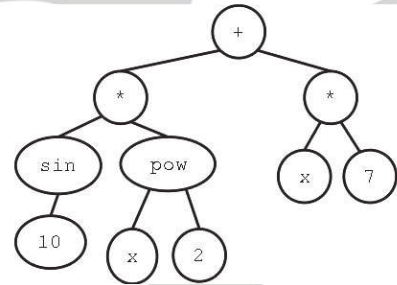

# Lecture 15: Genetic Programming

There are 2 different views of Genetic Programming:

1. Content View:

   - Automatic Programming
   - Creation of programs by artificial evolution
   - Different representations
   - Each *solution* from our algorithm is a program in its own right.

2. Representation View

   - Anything using a tree representation
   - Solutions may be programs may be other things

## Representing Programs

Tree Representation is one method of representing programs, this sort of structure was used heavily by LISP and LISP-inspired languages like Clojure. We can define our operators to work on these tree data structures

Linear representation is more common outside of this field, a program is represented as a series of instructions with registers to store data

Graph representations use nodes to contain instructions, edges to control the flow of the program and a stack for storing data.

## Tree Representation for Symbolic Regression

In a tree representation of a program our leaf nodes are either constants, function variables or even sensor values depending on the domain of the program these are known as the **Terminal Set**. 
They must have an arity of 0.

### The Function Set

Functions are described as being $n$-ary with $n$ referring to their arity or number of input variables.

We must make sure our set of functions is sufficiently complex for the task but not too rich as we risk overcomplicating the task

Functions must be defined over all inputs, for example we need to define division for input 0 if our function set includes division.

### Crossover

Crossover for tree structures is performed using a process called *branch swapping*. Here we pick a random branch on each parent and swap them.

#### Matched 1-point Tree Crossover

In this form of crossover, follow branches from the root, and, as long as the nodes have the same arity, swap them. 

$n$-o=point crossover is also possible.

### Mutation

Mutation is performed using *branch replacement*:

1. Pick a random branch from parent
2. Delete branch
3. Replace with random new branch

### Population Initialisation

#### Full Method 

With fixed tree depth $\texttt{treeDepth}$:

- Add random function nodes until all branches have depth of $\texttt{treeDepth} -1$ 
- Add random terminal nodes to all branches

#### Growth Method

With a fixed max tree depth $\texttt{maxDepth}$ 

- Add random function or terminal nodes until all branches have terminals or are of depth $\texttt{maxDepth} -1 $ 
- Add random terminal nodes to all branches without terminals 

#### Ramped half-and-half 

With a fixed maximum tree depth $\texttt{maxDepth}$ and population size $\texttt{popSize}$ 

- for n=2..$\texttt{maxDepth}$ create:
  - $( \frac{\texttt{popSize}}{2\times\texttt{maxDepth}-1} )$ individuals using growth in with $\texttt{maxDepth} = n$ 
  - $( \frac{\texttt{popSize}}{2\times\texttt{maxDepth}-1} )$ individuals using full with $\texttt{treeDepth} = n$ 

### Bloat

As program size grows, crossover becomes uneven, we gain unused code and runtime increases. More space is required to store the program and more CPU time is required to run it. Mutation and crossover of unused code lead to identical offspring behaviour 

To prevent bloat, we can incorporate program size into to the fitness measure and use special crossover operators

## Linear Representation Genetic Programming

Linear programs are designed to run efficiently on machines following the Von-Neumann architecture, also known as a register machine. Programs are represented as a string of instructions and data. Both instructions and data take binary string format. 

Genetic Programs of this format have crossover operators defined using variable length to define the $n$ points used in crossover. Mutation for such programs is performed using the *usual* random gene replacement but are extended to include add and delete operations. 

## Graph representation Genetic Programming 

In genetic programs represented as graphs, nodes represent operations while operands are loaded from the stack. Results are pushed onto the same stack once computed. Edges of the graph define the control flow with control mechanisms being used to determine the which edges to follow, flow mechanisms include comparators on the most recent result such as branching differently depending on whether the result is positive or negative. Loops and recursion are commonplace in such representations. Programs of this form require specialised crossover and mutation operators.

## Evolution of a complete robot

For a task such as this, we use inter-population cooperative co-evolution.
