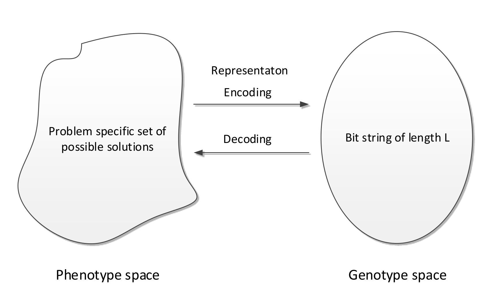

# Lecture 5: Evolutionary Algorithms

## Evolution in Nature

Evolution is the change in inherited characteristics of biological populations over successive generations

- Heritable characteristics/ traits
  - such as the colour of ones eyes
  - passed from one generation to the next in DNA 
- Change or genetic variation comes from: 
  - mutations: random changes in the DNA sequence
  - Crossover: re-shuffling of genes through sexual reproduction and migration between populations.

The driving force of evolution is **natural selection** - the survival of the fittest 

- Genetic variation that enhance the survival and reproduction become and remain more common in successive generations of a population.


*How do we map the relationship between evolution and optimisation?* 

$\texttt{Fitness} \rightarrow \texttt{objective function} \text{ in optimisation}$
$\texttt{Individuals} \text {of a species} \rightarrow \texttt{solution} \text{ in optimisation}$

## What are Evolutionary Algorithms?

Evolutionary Algorithms (EAs) are a subset of meta-heuristic algorithms inspired by biological evolution, which include: *Genetic Algorithms, Evolutionary Programming, Evolution Strategies and Differential Evolution*

They are essentially a kind of stochastic local search optimisation algorithm.

$\text{Evolutionary Algorithms} \in \text{Meta-Hueristics} \in \text{Stochastic Local Search algorithm} \in \text{Search and enumeration algorithms}$

A characteristic of EAs is that they are **population based**. i.e. they generate, maintain and optimise a population of candidate solutions

```basic
    X_0 := generate initial population of solutions
    terminationFlag := false
    t := 0 
    Evaluate the fitness of each individual in X_0
    while (terminationFlag != true) {
        Selection: select parents from X_i based on their fitness 
        Variation: Breed new individuals by applying variation operators to parents 
        Fitness Calculation: Evaluate the fitness fo new individuals 
        Reproduction: Generate population X_t++ by replacing least-fit individuals
        t ++ 
        If a termination criterion is met: terminationFlag := true
    }
``` 

## Building Blocks of Evolutionary Algorithms 

An Evolutionary Algorithms is made up of:

- A **representation** each solution is called an *individual*
- A **fitness** (objective) function: to evaluate solutions
- **Variation operators**: mutation and crossover 
- **Selection and reproduction**: survival of the fittest

Optimisation is about finding a global optimum. To do this we must balance exploration against exploitation 

In order to use an EA to solve a problem you need each of the building blocks listed above 

### Representation

This is a way to represent or encode solutions 

If we had a optimisation problem where the fitness of a solution is given by $f(x)$, where $x$ is the candidate solution. 

- Solution $x\in X$ is called a **phenotype**
- We encode the solutions using some form of **representation**
- The representation of a solution is called a **genotype**
- Variation operators act on genotypes 
- Genotypes are decoded into phenotypes
- Phenotypes are evaluated using the fitness function $f(x)$
- Decoding and encoding functions map phenotypes and genotypes
- The search space of solutions is the set of genotypes and phenotypes


The selection of our representation depends on the problem.
Some possible representations include but are not limited to:

- Binary representation
- Real number representation 
- Random key representation
- Permutation representation 

### Binary Representation

A traditionally very popular representation for use in genetic algorithms 

Represent an individual as a bit string of length $L$ : $\vec{a} \in \{ 0 , 1 \}^L$ - Genotypes 
 
Map phenotypes to bit string genotypes $\{0,1\}^L$ via an encoding function

Map genotypes to phenotypes by a decoding function



#### Decoding Function 

Using a bit string to represent binary or integer solutions is trivial however, given an optimisation probelm with $n$ continuous variables, how do we represent them using a bit string of length $L$ 

- Note: Usually each continuous variable will have an interval bound such as : $x_i \in [ u_i, v_i ]$

To solve this:

- Divide $\vec{a} \in \{0,1\}^L$ into $n$ segments of equal length 

$$
\vec{s_i} \in \{0,1\}^{\frac{L}{n}}, \; i = 1, \ldots , n
$$

- Decode each segment into an integer $K_i, \; i=1,\ldots,n$ and,

$$
K_i = \sum_{j=0}^{\frac{L}{n}}s_{i_j} \cdot 2^j
$$

- Apply decoding function $h(K_i)$ i.e. map the integer linearly into the interval bound $x_i \in [u_i, v_i]$:

$$
h(K_i) = u_i + K_i \cdot \frac{v_i - u_i}{2^{\frac{L}{n}}-1}
$$

### Mutation 

To mutate our candidate solutions we flip each bit with a probability of $p_m$,  called the *mutation rate*

A standard mutation rate is $p_m = \frac{1}{L}$ but can be in the range $p_m \in \left[\frac{1}{L}, \frac{1}{2}\right]$

If we use a low mutation rate, we can see this as creating a small a small random perturbation on the parent genotype. The mutated offspring are largely the same as their parents so will be close together in a search space relative to their *Hamming distance*. 
Together with selection mutation performs a stochastic local search: it exploits the current best solutions by randomly exploring the search space around them.

### Crossover 

In the crossover process, two parents are selected randomly with a probability $p_c \in [0,1]$ 

In *1 point crossover*: select a single crossover point on two strings, swap the data beyond that point in both strings


In *$n$ point crossover*:

- Select multiple crossover points on two strings,
- Split strings into parts using those points
- Alternating between the two parts and concatenate


In Uniform crossover:

- $\forall i \in \{ 1,\ldots,L\}$, toss a coin 
- If *head*: copy bit $i$ from parent 1 to offspring 1, parent 2 to offspring 2 
- If *tail*: copy bit $i$ from parent 1 to offspring 2 and parent 2 to offspring 1.


