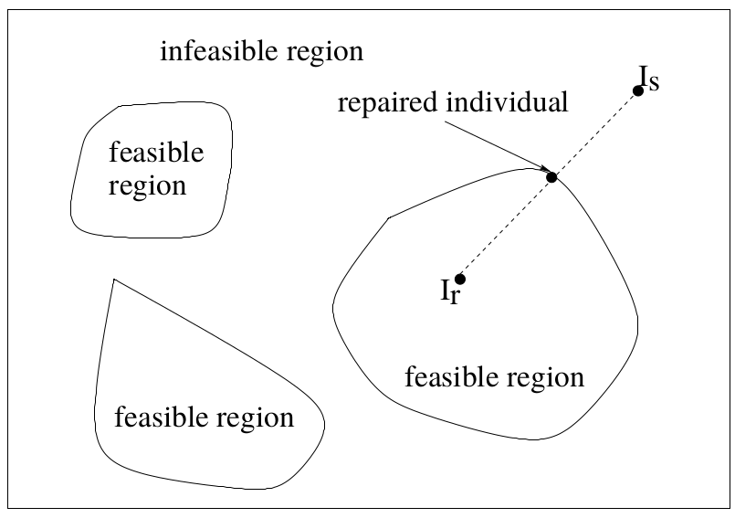
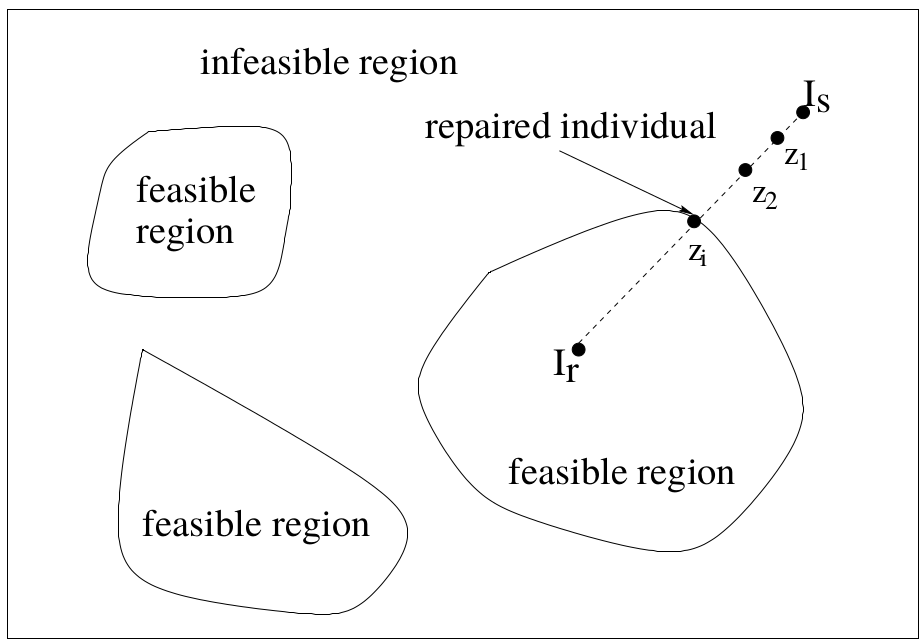

# Lecture 8: Constraint Handling in Evolutionary Algorithms

## Motivation

### Spring Design

$\texttt{Aims:}$ to minimise the weight of a tension/ compression spring. All design variables are continuous.

$\texttt{Constraints:}$ 

1. Minimum deflection
2. Shear stress
3. Surge frequency
4. Diameters

Let the wire diameter $d=x_1$, the mean coil diameter $D=x_2$ and the number of active coils $N=x_3$. The following are the constraints on these variables:

$$
0.05 \leq x_1 \leq 2, \;\; 0.25 \leq x_2 \leq 1.3 , \;\; 2 \leq x_3 \leq 15
$$

We can write this as a function to minimise:

$$
f(X) = (x_3 +2)\cdot x_2 \cdot x_1^2
$$

which is subject to the following: 

$$
g_1(X) = 1 - \frac{x_2^3x_3}{71785x_1^4} \leq 0
$$

$$
g_2(X) = \frac{4x_2^2 - x_1x_2}{12566(x_2x_1^3 -  x_1^4)} + \frac{1}{5108x_1^2} - 1 \leq 0
$$

$$
g_3(X) = 1- \frac{140.45x_1}{x_2^2x_3} \leq 0
$$

$$
g_4(X) = \frac{x_2 + x_1}{1.5} -1 \leq 0 
$$

#### Engineering Optimisation

Also known as *Design Optimisation*, this is the process to find the combination of design variables that optimises the design objective and satisfies the constraints.

A design variable is under the control of the designer and could have an impact on the solution of the optimisation problem. They can be:

- Continuous
- Integers
- Sets of variables, often taken from a list of recommended values from design standards

Design objectives represent the desires of the designers such as to maximise profit or minimise cost

Constraints are desires the designers cannot optimise infinitely due to:

- Limited resources such as budget or materials
- User requirements or regulations

A design constraint is usually *rigid* or *hard* as they often need to be strictly adhered to. 

Engineering optimisation problems fall under **constrained optimisation problems**

## Constrained Optimisation Problems

In general a constrained optimisation problem can be represented as: 

$$
\min_{\vec{x}} \{f(\vec{x})\}
$$

subject to:

$$
g_i(\vec{x}) \leq 0, \forall i \in \{1,\ldots,m\}
$$
$$
h_j(\vec{x}) = 0, \forall j \in \{1,\ldots,p\}
$$

where $x$ is the $n$ dimensional vector $\vec{x} = (x_1,x_2,\ldots, x_n)$, $f(\vec{x})$ is the objective function, $g_i(\vec{x})$ is the inequality constraint and $h_j(\vec{x})$ is the equality constraint

We denote the search space as $\mathcal{S}$ and the feasible space as $\mathcal{F} \in \mathcal{S}$. The global optimum of $\mathcal{F}$ might not be the same as that of $\mathcal{S}$ 

### Types of Constraints

There are two main types of constraints we will look at:

1. Linear Constraints: relatively easy to deal with 
2. Non-linear Constraints: can be much harder to deal with. 

### Constraint Handling in Evolutionary Algorithms

- The purist approach: rejects all infeasible solutions in search
- The separatist approach: considers the objective function and constraints separately
- The penalty function approach: converts a constrained problem into an unconstrained one by introducing a penalty function into the objective function.
- The repair approach: maps *(repairs)* an infeasible solution into a feasible one
- The hybrid approach: mixes two or more above approaches

#### Penalty Function Approach

There are 3 sub approaches under the penalty function method: 

##### Static Penalties

The penalty function is pre-defined and fixed during evolution

The general form of static penalty function is:

$$
f'(\vec{x}) = f(\vec{x}) + \sum_{i=1}^{m}r_i(G_i(\vec{x}))^2
$$

where $r_i$ are fixed, predefined values 

Equality constraints can be converted into inequality contraints:

$$
h_j(\vec{x}) \rightarrow h_j(\vec{x}) - \epsilon \leq 0{}
$$

Where $\epsilon > 0$ but is small

This approach is simple to implement but requires rich domain specific knowledge to accurately set $r_i$ 

$r_i \forall i \in (1,\ldots, m+p)$ can be divided into a number of different levels. When to use each level is determined by a set of heuristics, such as the more important the constraint, the larger the value of $r_i$ 

##### Dynamic Penalty Functions 

Dynamic Penalty Functions take the general form: 

$$
f'(\vec{x}) = f(\vec{x}) + r(t) \cdot \sum_{i=1}^{m}G_i^2(\vec{x}) + c(t) \cdot \sum_{j=1}^{p}H_j^2(\vec{x})
$$

Where $r(t)$ and $c(t)$ are two penalty coefficients 

The general principal of DPFs is that larger the generation number $t$, the larger the penalty coefficients $r(t)$ and $c(t)$ 

###### Common Dynamic Penalty Functions

Common Dynamic Penalty Functions include: 

- Polynomials: $r(t)= \sum_{k=1}^{N}a_{k-1}t^{k-1}, \;\;\; c(t) = \sum_{k=1}^{N}b_{k-1  }t^{k-1}$ 
  - Where $a_k$ and $b_k$ are user-defined parameters
- Exponentials: $r(t) = e^{at}, \;\;\; c(t) = e^{bt}$ 
  - Where $a$ and $b$ are user-defined parameters
- Hybrid: $r(t) = e^{ \sum_{k=1}^{N}k_{k-1}t^{t-1} }, \;\;\; c(t) = e^{\sum_{k=1}^{N}b_{k-1}t^{k-1}}$ 

### Application

Given a static penalty function $\Phi(\vec{x}) = f(\vec{x}) + rG(\vec{x})$ where $G(\vec{x}) = \sum_{i=1}^{m}G_i(\vec{x})$ and $G_i(\vec{x}) = \max\{0,g_i(\vec{x})\}$

*How does $r$ affect our training?* 

For a minimisation problem using $\Phi(\vec{x})$ for two individuals $\vec{x_1}$ and $\vec{x_2}$, their fitness values are not determined by $\Phi(\vec{x}) \implies$ changing fitness values

Fitness proportional selection: As we now have changing fitness values we, by extension, have changing selection probabilities.

Ranking Selection: $\Phi(\vec{x_1}) < \Phi(\vec{x_2}) \implies f(\vec{x_1}) + rG(\vec{x_1}) \leq f(\vec{x_2}) + rG(\vec{x_2})$

- $(f(\vec{x_1}) < f(\vec{x_2}) )\cap (G(\vec{x_1}) > G(\vec{x_2})) \implies f(\vec{x_1} - f(\vec{x_2}) < 0 \cap G(\vec{x_1} - G(\vec{x_2}) > 0$  increasing $r$ will eventually change the comparison 
-  $(f(\vec{x_1}) > f(\vec{x_2}) )\cap (G(\vec{x_1})  < G(\vec{x_2})) \implies  f(\vec{x_1} - f(\vec{x_2}) > 0 \cap G(\vec{x_1} - G(\vec{x_2}) < 0$  Decreasing $r$ will eventually change the comparison. 

From this we can see that different $r$ values lead to different ranking of individuals in the population.

The use of different penalty functions lead to different objective functions and therefore different explorations of the search space, finding different optima.


Essentially, penalty function transform fitness and change the ranking system leading to different candidates being selected. 
Inappropriate penalty function lead to infeasible results, setting $r$ is difficult

# Part 2

## Stochastic Ranking

*Proposed by Prof. Xin Yao a lecturer at the University of Birmingham in 2000*

This is a rank-based selection scheme that handles constraints
It does not use penalty functions and is self adaptive

### Ranking Selection

Sort a population of size $M$ from best to worst, according to their fitness values:

$$
x_{(M-1)}',x_{(M-2)}',\ldots, x_{(0)}'
$$

From this set we select the top $\gamma$-ranked individuals $x_{\gamma}'$ with probability $p(\gamma)$ where $p(\gamma)$ is a ranking function such as:

- Linear Ranking
- Exponential Ranking
- Power Ranking
- Geometric Ranking

Penalty functions essentially perform a transformation of the objective, fitness function. A rank change $\implies$ a selection change.

Here we instead change the rank  directly in the Evolutionary Algorithm.

We can view ranking as the same as sorting. We can modify the sorting algorithm in the EA to consider constraint violation.

Stochastic Ranking is essentially a modified form of bubble sort with some additional rules to handle constraints

### Stochastic Ranking Algorithm

```python

for j:=1 to M:  
  for i := 2 to M:
    u := U(0;1) # randomly uniformly distributed random number
    if G(x'[i-1]) = G(x'[i]) == 0 or u <= P_f :
      # Swap values so that better (smaller) are before the larer ones
      if f(x'[i-1]) < f('[i]):
        swap(I[i], I[i-1])
        swap(f(x'[i]),f(x'[i-1]))
        swap(G(x'[i]),G(x'[i-1]))
    else:
      if G(x'[i-1]) < G(x'[i]):
        swap(I[i], I[i-1])
        swap(f(x'[i]),f(x'[i-1]))
        swap(G(x'[i]),G(x'[i-1]))
```

Where:

- $M$ is the number of individuals
- $I$ is the indicies of the individuals
- $G(\cdot)$ is the sum of constraint violation
- $P_f$ is a constant that indicates the probability of using the objective function for comparison ranking.


#### $P_f$ 
Why do we introduce $P_f$ given that is allows for infeasible solutions, in the cases where their fitness values are higher than feasible ones, with some probability? 

Where $P_f > 0.5$: Most comparisons are based solely on $f(x), \therefore$ infeasible solutions are likely to occur.

Where $P_f < 0.5$ : Most comparisons are based on $G(x), \$\therefore$ infeasible solutions are lss likely to occur, however, the resulting solutions may be poor 

Recommended values of $P_f$ fall between 0.45 and 0.5

If penalty functions perform fitness transformation, converting rank change to selection change. Stochastic ranking changes ranks by changing the sorting algorithm. Why do we not change selection directly in the EA?

## Feasibility Rule 

- Based on binary tournament selection
- Having selected 2 random individuals to form a binary tournament, apply the following rules:
  - Between 2 feasible solutions, the one with the better fitness value *wins*
  - Between a feasible and infeasible solution, the feasible solution wins
  - Between two infeasible solutions, the one with the lowest value for $G$ wins

This method is simple and parameter free, however, it can lead to premature convergence.

## The Repair Approach to Constraint Handling 

Instead of modifying an EA or fitness function, infeasible individuals can be *repaired* into feasible ones

Let $I_s$ be an infeasible individual and $I_r$ be a feasible one. 



### Repairing Infeasible Individuals

For this process we maintain two populations:

1. A population of evolving individuals, feasible or infeasible.
2. A population of feasible reference individuals, subject to change but not evolution.



#### Algorithm

```basic

I_r = select a reference individual
do until individual z_i is feasible{
  z_i = a_i * I_s + (1-a_i)* I_r, where 0<a_i < 1
  calculate the fitness value of z_i : f(z_i)
  if f(z_i) <= f(I_r) then replace I_s with z_i
  else{
    u = U(0;1) // uniformly distributed random number
    if u <= Pr then replace I_s with z_i
  }
}
```

Notice we replace $I_r$ with $z_i$ with some probability $Pr$ even though $z_i$ is worse than $I_r$ 

##### Implementation Issues

- How do we find our initial feasible individuals?
  - Premliminary exploration
- How do we select $I_r$ 
  - (uniformly) randomly 
  - according to it's fitness
  - According to the distance between $I_r$ and $I_s$ 
- How do we determine $a_i$ 
  - Uniformly at random between 0 and 1 
  - Using a fixed sequence 
- How do we choose $Pr$ 
  - A small number, usually <0.5

## Conclusion

Adding a penalty term to the objective function is equivalent to changing the fitness function, which, in turn, is equivalent to changing the selection probabilities. It is easier and more effective to change the selection probabilities directly and explicitly using Stochastic ranking and Feasibility rules.
We have also seen that there are alternative constraint handling techniques such as repairing methods.