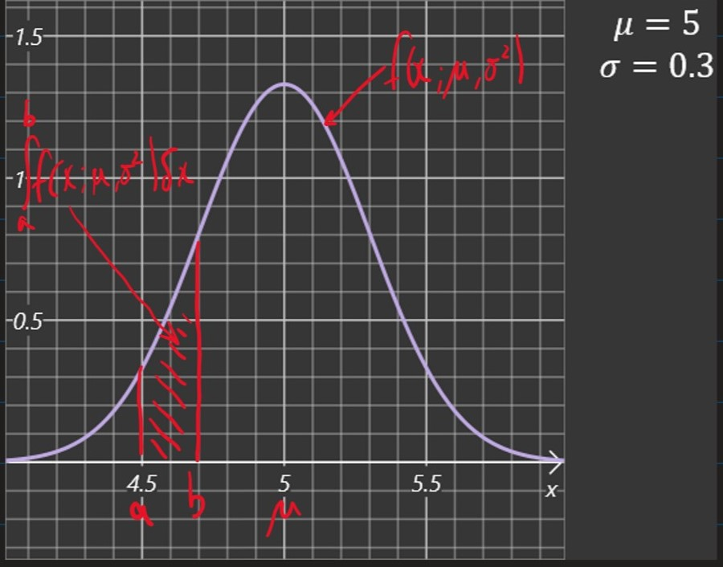

# Lecture 3: Maximum Likelihood 

- So far we have considered a **deterministic model**, $f(x) = wx$

- However, we can see that there is **variation** in the data for each value of $x$
- A **probabilistic model** can account for this variance
  - e.g. $F(x) = wx + N$
  - where: 
    - $N \sim \mathcal{N}(0,\sigma^2)$
    - is a *noise term* 
    - $F(X)$ is a *random variable* which can be described by a *conditional density* $P(y | x, w)$
  
____

## An aside into basic probability

### Probability Density Functions

- A **random variable** takes a value that depends on a random phenomenon
- The **density function** ofa continuous random variable $X$ is a function $p : \R \rightarrow \R$ s.t.
  - $\int_a^b p(x) \delta x = Pr(a \leq x \leq b) $

- The normal distribution has the probability density function 

###### (1) 

$$f(x ; \mu , \sigma^2) = \frac{1}{\sqrt{2\pi \sigma^2}}\exp(-\frac{(x - \mu)^2}{2\sigma^2})$$

- Where $\mu$ and $\sigma^2$ are the parameters of the distribution. 

### Expectation 

- The **expected value** of $f(x)$ when $x$ is a random variable with *p.d.f* $P$ is

###### (2) 

$$\mathbb{E}_{x\sim P}[f(x)] = \int_{-\infin}^{\infin} P(x)f(x) \delta x$$

### Joint Distributions and Independence

- The **joint density function** of $n$ random variables $x_1, \cdots, x_n$ is a function $P : \R^n \rightarrow \R$ s.t. 

###### (3) 

$$\int_D P(x_1,\cdots, x_n)\delta x_1 \cdots \delta x_n = Pr((x_1 ,\cdots, x_n)\in D)$$ 

- for any $n$-dimensional domain $D \subseteq \R^n $

- if $x_1,\cdots, x_n$ are $n$ **independent** random variables with density functions $P_1, \cdots, P_n$ and joint density $P$ then 

###### (4) 

$$P(x_1,\cdots, x_n) = \prod_{i=1}^n P_i(x_i)$$

### Empirical Distribution

- Given $n$ independent samples $X_i, \cdots, X_n$ from an unknown distribution, $\mathcal{D}$, we can construct an *approximation* of $\mathcal{D}$ by uniformly sampling from the set $\{X_1, \cdots, X_n\}$

- Given $X_1, \cdots , X_n$ initial samples from $\mathcal{D}$, the **empirical distribution** of $\mathcal{D}$ has the density function:

###### (5) 

$${Pr}^n(x) := \frac{1}{n}\sum_{i=1}^{n} \delta(X_i - x)$$

- Where $\delta$ is the *Divac delta* i.e. $\delta(x) = 0$ for $x\neq 0$ and $\int_{-\infin}^\infin \delta(x) \delta x = 1$

**Note: $\mathbb{E}_{X\sim{Pr}^n}[f(X)] = \frac{1}{n}\sum_{i=1}^n f(X_i)$**

### The Learning Task, $T$

- Instead of deterministically predicting an output $y$ for a given input $x$ we will now train a probabilistic model represented by a conditional density function

###### (6)

$$P_{model}(y | x ; \theta)$$

- Where:
  - $y\leftarrow$  density function of output
  - $x\leftarrow$  input
  - $\theta \leftarrow$ parameter of model

- Given training data and a *family* of probability models we need to choose the parameter(s) $\theta$ which are most appropriate for the data. We call this the **Maximum likelihood estimate**

### Likelihood function 

- Given independent training data $(x_1,y_1), \cdots, (x_n,y_n)$ and a probabilistic model $P_{model}$ with parameter $\theta$, the **likelihood function** is defined as:

###### (7)

$$\mathcal{L}(\theta; (x_1,y_1), \cdots , (x_n,y_n)) := \prod_{i=1}^n P_{model}(y_i | x_i ; \theta)$$

- $\mathcal{L}(\theta; ...)$ is the *likelihood* that the observed data came from the model with parameter $\theta$ 

### Maximum Likelihood Estimate (MLE)

- Given training data and a family of models indexed by the parameter $\theta$, *which of the models are most likely to have produce the data?*

###### (8)

$$\Theta_{MLE} := \argmax_\theta \mathcal{L}(\theta; (x_1,y_1),\cdots, (x_n,y_n)) = \argmax_\theta \prod_{i=1}^n P_{model}(y_i | x_i; \theta)$$

#### Log-Likelihood

- For numerical and analytical reason, a convenient reformation is: 

###### (9)

$$\Theta_{MLE} = \argmax_\theta \mathcal{L}(\theta) \\
= \argmax_\theta \log \mathcal{L(\theta)} \\ 
= \argmax_\theta \log \Pi_{i=1}^n P_{model}(y_i | x_i ; \theta) \\
= \argmax_\theta \sum_{i=1}^n \log P_{model} (y_i | x_i ; \theta) \\ 
= \argmin_\theta \frac{1}{n}\sum_{i=1}^n -\log P_{model} (y_i | x_i ; \theta) \\ 
= \argmin_\theta \mathbb{E}_{(\mathcal{X},\mathcal{Y})\sim \mathcal{D}^n} - \log P_{model} (\mathcal{Y} | \mathcal{X} ; \theta) $$

##### Learning via Log-Likelihood 

- Neural network models are often trained by minimising the negative log-likelihood of the model given the training data, i.e. by minimising:

###### (10)

$$J(\theta) = \mathbb{E}_{\mathcal{X},\mathcal{Y}\sim \mathcal{D}^n}- \log P_{model}(\mathcal{Y | X} ;\theta)$$

- Where:
  - $J(\theta)\leftarrow$ Cost function 
  - $\theta \leftarrow$ model parameter(s) 
  - $\mathcal{D}^n \leftarrow$ empirical distribution of data