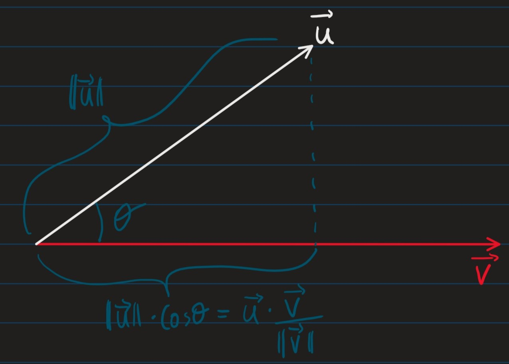

# Lecture 4

- So far we have only looked at models with 1 parameter

###### (1)

$$ J(\Theta) = \mathbb{E}_{\mathcal{X,Y}\sim \mathcal{D}}-\log_{Pmodel}(\mathcal{Y | X; \Theta)}$$

- We will nw look at models with many variables

## Functions of multiple variables

### Vectors

- Vectors are "arrays" of numbers e.g.

###### (2)

$$\vec{v} = \langle v_1, \cdots, v_n \rangle \in \R^n$$

- We can consider a vector as a point i a $n$ dimensional space where each point $v_i$ gives the coordinate along the $i^{th}$ axis.

#### Properties of vectors

- Norms: assigns *"length"* to vectors
- The $L^{p}$-norm of a vector $\vec{v}\in \R^n$ is

###### (3)

$$\|\vec{v}\|_p = (\sum_{i=1}^{n}|v_i|^p)^{\frac{j}{p}}$$

- The special case where $p=2$, $L^2$-norm is the *euclidean norm/ distance* denoted $\|\vec{v}\| = \|\vec{v}\|_2$

#### Operations on vectors

$$\forall a \in \R, \\ \vec{u} \in \langle u_1, \cdots , u_m \rangle \in \R^m \\
                 \vec{v} \in  \langle v_1, \cdots, v_m \rangle \in \R^m $$

- $a \cdot \vec{u} = \langle au_1, \cdots, au_m \rangle \leftarrow$ *Scalar Multiplication*
- $\vec{v} + \vec{u} = \langle v_1 + u_1, \cdots , v_n+u_n \rangle \leftarrow$ *Vector addition*
- $\vec{v}\cdot\vec{u} = \sum_{i=1}^{m} v_iu_i \leftarrow$ *Dot product*

### Theorem: Geometric interpretation of dot-product

- Given the 2 vectors $\vec{u}, \vec{v}$, defined above, if the angle between them is $\theta$:

###### (4)

$$\vec{u}\cdot\vec{v} = \|\vec{u}\| \cdot \|\vec{v}\|\cdot\cos\theta$$

### Partial Differentiation 

- The partial derivative of the function $f(x_1,\cdots,x_n)$ in the direction of the variable $x_i$ at the point $\vec{u} = \langle u_1, \cdots, u_n \rangle$ is

###### (5)

$$\frac{\delta f}{\delta x_i}(u_1,\cdots,u_n) = \lim_{h\rightarrow 0} \frac{f(u_1,\cdots,u_i+h,\cdots,u_n)-f(u_1,\cdots, u_n)}{h}$$

### Gradient 

- The gradient of function $f(x_1,\cdots, x_n)$ is

###### (6) 

$$\nabla f := (\frac{\delta f}{\delta x_1},\cdots, \frac{\delta f}{\delta x_n})$$

- And iff $f: \R^n \rightarrow \R$, then $\nabla f : \R^n \rightarrow \R^n$
  - i.e. the gradient is a vector-valued function

### Chain Rule (Special Case)

| For 1D functions   | For higher dimensional functions  |
|---|---|
|if $y=f(u)$ and $u = g(x)$ $\\$ then $\\$ $\frac{\delta y}{\delta x}= \frac{\delta y}{\delta u} \cdot \frac{\delta u}{\delta x}$   | If $y=f(u_1,\cdots, u_m)$ and $u_i = g(x_1,\cdots,x_m)$ for $i \in \{1,\cdots,m\}$ $\\$ then $\\$ $\frac{\delta y}{\delta x_i} = \sum_{j=1}^m \frac{\delta y}{\delta u_j}\cdot \frac{\delta u_j}{\delta x_i}$  |

### Directional Derivative 

#### Definition

- Given a function:

###### (7)

$$f : \R^m \rightarrow \R$$

- And a vector

###### (8)

$$\vec{v} = \langle v_1,\cdots,v_m\rangle \mid \|\vec{v}\| = 1$$ 
 
- The directional derivative of $f$ at $\vec{x} = \langle x_1, \cdots, x_m \rangle$  along [the vector $\vec{v}$](8) is

###### (9)

$$\nabla_{\vec{v}} f(\vec{x}) := \lim_{\alpha \rightarrow 0} \frac{f(\vec{x}+ \alpha \vec{v}) - f(\vec{x})}{\alpha}$$
$$= \lim_{\alpha \rightarrow 0} \frac{f(x_1+ \alpha v_1 , \cdots, x_m + \alpha v_m)- f(x_1,\cdots, x_m)}{\alpha}$$

#### Computing the Directional Derivative

- The following theorem implies that if we know the gradient $\nabla f$, then we can compute the derivative in any direction, $\vec{v}$

##### Theorem

###### (10)

$$\nabla_{\vec{v}}f(x) = \nabla f(x)\cdot\vec{v}$$

- Where:
  - $\nabla_{\vec{v}}f(x) \leftarrow$ is the directional derivative 
  - $\nabla f(x) \leftarrow$ is the gradient

##### Proof

- Define the function 

###### (11)

$$h(\alpha) := f(u_1,\cdots,u_m)$$

- Where:
  - $u_i := x_i + \alpha v_i, \forall i \in \{1,\cdots,m\}$
  - Note that $h : \R \rightarrow \R$, i.e. $h$ is a 1D real-valued function

###### (12) 

$$\nabla_{\vec{v}} f(\vec{x}) := \lim_{\alpha \rightarrow 0} \frac{f(\vec{x}+ \alpha \vec{v}) - f(\vec{x})}{\alpha}$$

- [From definition of $\nabla_{\vec{v}}f$](#9)

$$=\lim_{\alpha\rightarrow 0} \frac{h(0+\alpha)=h(0)}{\alpha}$$

- [By definition of $g$](#chain-rule-special-case)

###### (13)

$$= h'(0)$$

- By definition of Derivative 

- Using the Chain Rule, we have:

###### (14)

$$h'(\alpha) = \frac{\delta h}{\delta \alpha} = \sum_{i=1}^m \frac{\delta u_i}{\delta \alpha} = \sum_{i=1}^m \frac{\delta f}{\delta u_i}\cdot v_i$$

- Note that for $\alpha = 0$, we have:

###### (15) 

$$u_i = x_i + 0 \cdot v_i = x_i$$

- Using [(13)](#13), [(14)](#14) and [(15)](#15), we get:

###### (16)

$$\nabla_{\vec{v}}f(\vec{x}) = h'(0) = \sum_{i=1}^m \frac{\delta f}{\delta x_i}\cdot v_i = \nabla f(x)\cdot \vec{v}$$

### The Gradient Points Towards the Steepest Ascent

- The vector $\vec{v}$ along which $f$ has steepest ascent is:

###### (17) 

$$\argmax_{\vec{v} , \|\vec{v}\|=1} \nabla_{\vec{v}}f(\vec{x})$$

$$= \argmax_{\vec{v} , \|\vec{v}\|=1} \nabla f(\vec{x}) \cdot \vec{v}$$

$$= \argmax_{\vec{v} , \|\vec{v}\|=1} \|\nabla f(\vec{x})\|\|\vec{v}\|\cdot \cos\theta$$

$$ = \argmax_{\vec{v} , \|\vec{v}\|=1} \|\nabla f(\vec{x}) \|\cdot \cos\theta$$

- Where $\cos\theta$ is the angle between $\vec{v}$ and $\nabla f(\vec{x})$

- $\implies$ The vector $\vec{v}$ which gives the **steepest ascent** is the vector that has angle $\theta=0$ to $\nabla f$, i.e. the vector $\vec{v}$ which points in the same direction as $\nabla f$

### Method of Gradient Descent

***Input:** cost function: $J : \R^m \rightarrow \R$*
*&nbsp;&nbsp;&nbsp;&nbsp;&nbsp;&nbsp;&nbsp;&nbsp;&nbsp;&nbsp; learning rate: $\epsilon \in \R, \epsilon > 0$*

*$\vec{x} \leftarrow$ Some initial point in $\R^m$*
*while termination condition not met {*
&nbsp;&nbsp;&nbsp;&nbsp;&nbsp;&nbsp;&nbsp;&nbsp;&nbsp;&nbsp;&nbsp;&nbsp; $\vec{x}\leftarrow \vec{x} - \epsilon \cdot \nabla J(\vec{x})$
*}*