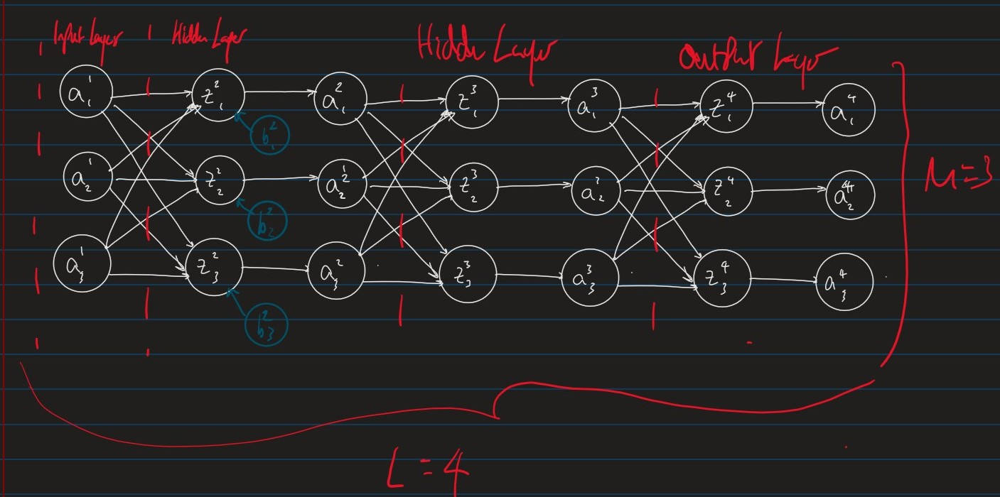
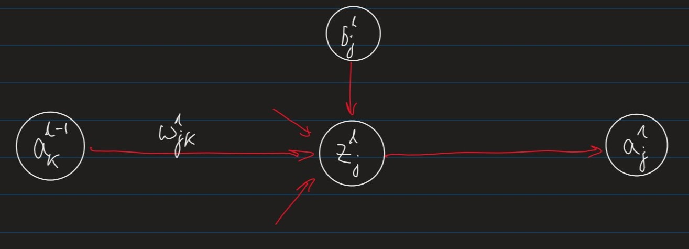
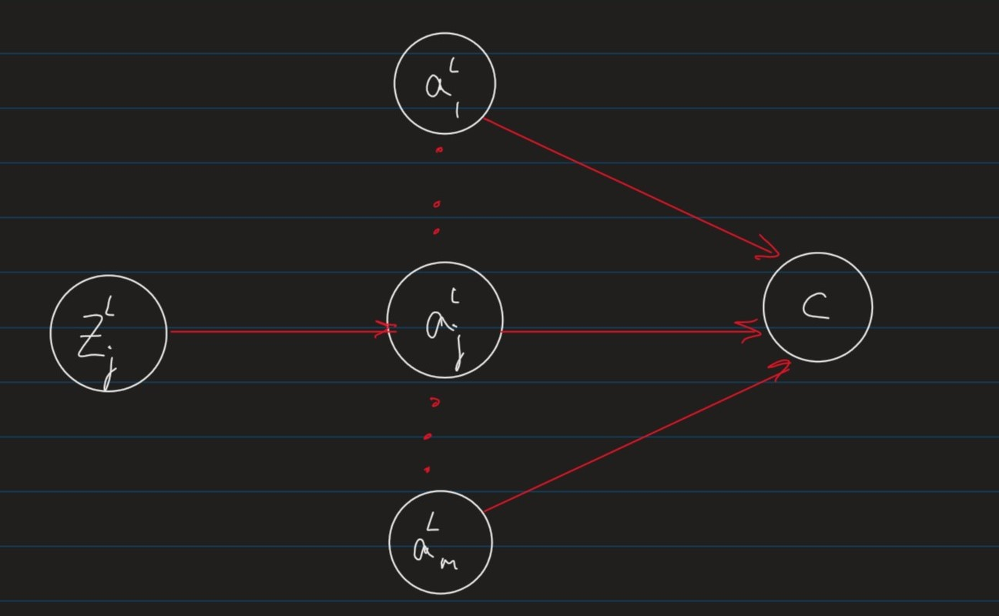
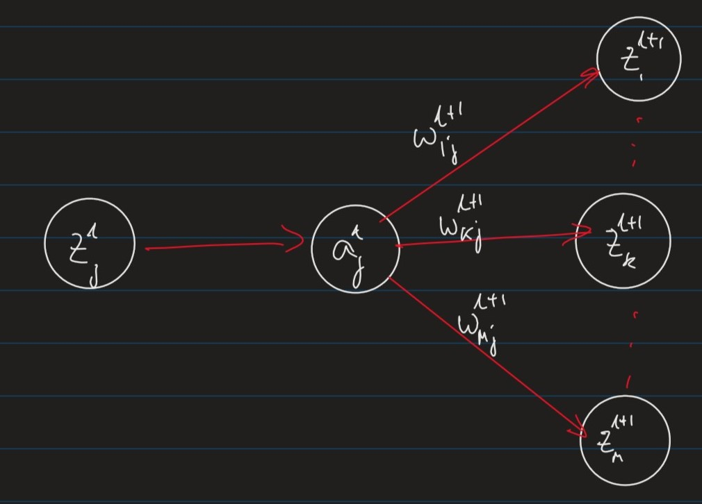

# Lecture 5

## Computation Graphs

We will describe ML models using **computation graphs** where

- *Nodes* represent variables (values, vectors, matrices)
- *Edges* represent functional dependencies
  - i.e. an edge from $x$ to $y$ indicates that $y$ is a function of $x$

### Example

The linear regression model, $z = \sum_{i=1}^m a_iw_i+b$ could be represented as:

## Feed-Forward Neural Network

Stepping it up, here is a *simple* Feed-forward Neural Network:

Where:

- $L \leftarrow$ number of layers in the network, where 
  - layer 1 is the *"input layer"* 
  - layer $L$ is the *"output layer"*
- $m\leftarrow$ is the *"width"* of the network, which can change for each layer
- $w_{jk}^l\leftarrow$ is the *"weight"* of the connection between the $k^{th}$ unit in layer $l-1$, to the $j^{th}$ unit in layer $l$
- $b_j^l\leftarrow$ is the *"bias"* of the $j^{th}$ unit in layer $l$
  - ***Note:** These appear for every $z$ node, for illustrative purposes I have only shown them on the first bank.*
- $z_j^l = \sum_k w_{jk}^l a_k^{l-1} + b_j^l \leftarrow$ is the weighted input unit $j$ in layer $l$
- $a_j^l = \phi(z_j^l)\leftarrow$ is the *"activation"* of unit $j$ in layer $l$, where $\phi$ is an *"activation function"*.
  

### Training of Feed-Forward Neural Networks

The parameters of the network are: 

- The weights $w_{jk}^l$ in each layer
- The Biases $b_j^l$

#### General Idea

To apply gradient descent to optimise a weight $w$ (or bias $b$) in a network,we apply the chain rule

###### (1)

$$\frac{\delta C}{\delta w} = \frac{\delta C}{\delta v}\cdot\frac{\delta v}{\delta w}$$

###### (2)

$$z_j^l = \sum_{k=1}^m w_{jk}^l a_k^{l-1}+ b_j^l$$

###### (3)

$$a_j^l = \phi(z_j^l)$$

###### (4)

$$\frac{\delta C}{\delta w_{jk}^l} = \frac{\delta C}{\delta z_j^l}\cdot\frac{\delta z_j^l}{\delta w_{jk}^l} = \frac{\delta C}{\delta z_j^l}\cdot a_k^{l-1}$$

Where $a_k^{l-1}$ is the *"activation"* of unit $k$ in layer $l-1$ 

###### (5)

$$\frac{\delta C}{\delta b_j^l} = \frac{\delta C}{\delta z_j^l}\cdot \frac{\delta z_j^l}{\delta b_j^l} = \frac{\delta C}{\delta z_j^l}\cdot 1$$

Hence, we can compute $\frac{\delta C}{\delta w_{kj}}$ and $\frac{\delta C}{\delta b_j^l}$ if we know:

###### (6)

$$\delta_j^l := \frac{\delta C}{\delta z_j^l}$$

The vector $\delta^l$ is called the **local gradient** for layer $l$

##### Local Gradient for output layers

###### (7)

$$a_j^L = \phi(z_j^L)$$

The local gradient for the output layer is:

###### (8)

$$\delta_j^L = \frac{\delta C}{\delta z_j^L}$$
[By definition](#6)

$$= \frac{\delta C}{\delta a_j^L}\cdot\frac{\delta a_j^L}{\delta z_j^L}$$
By the chain rule

$$= \frac{\delta C }{\delta a_j^L} \cdot \phi'(z_j^L)$$
Because $a_j^L = \phi(z_j^L)$

The partial derivative $\frac{\delta C}{\delta a_j^L}$ depends on the cost function.
For example, for a regression problem in $m$ dimensions, one could define :

###### (9)

$$C(a_1^L,\cdots,a_m^L) := \frac{1}{2}\sum_{k=1}^m (y_k - a_k^L)^2$$
Where:

- $y_k$ is the desired output in the $k^{th}$ dimension
- $a_k^L$ is the predicted output in the $k_{th}$ dimension

- **i.e. this is essentially mean squared error**  

in which case,

###### (10)

$$\frac{\delta C}{\delta a_j^L}= a_j^L - y_j$$

##### Local Gradient for Hidden Layers

###### (10)

$$z_k^{l+1} = \sum_r w_{kr}^{l+1} a_r^l$$

$$a_j^l = \phi(z_j^l)$$

###### (11)

$$\delta_j^l = \frac{\delta C}{\delta z_j^l}$$
By [definition of local gradient $\delta_j^l$](#6)
$$= \frac{\delta C}{\delta a_j^l}\cdot \frac{\delta a_j^l}{\delta z_j^l}$$
By chain rule
$$= \left(\sum_k \frac{\delta C}{\delta z_k^{l+1}} \cdot \frac{\delta z_k^{l+1}}{\delta a_j^l}\right)\cdot \phi'(z_j^l)$$
By chain rule with respect to $\frac{\delta C}{\delta a_j^l}$

$$= \phi'(z_j^l)\sum_k \delta_k^{l+1}\cdot w_{kj}^{l+1}$$
By [definition of local gradient $\delta_k^{l+1}$]()

##### Summary

$\forall$ weights, $w$ and biases $b$

###### (12)

$$\frac{\delta C}{\delta w_{jk}^l} = \delta_j^l\cdot a_k^{l-1}$$

###### (13)

$$\frac{\delta C}{\delta b_j^l} = \delta_j^l$$

Where the local gradient $\delta_j^l$ is: 

###### (14)

$$\delta_j^l =
\begin{cases}
\phi'(z_j^L)\cdot \frac{\delta C}{\delta a_j^L} &\text{if $l=L$ (output layer)} \\\\
\phi'(z_j^l)\cdot\sum_k \delta_k^{l+1}\cdot w_{kj}^{l+1} &\text{otherwise (hidden layer)}
\end{cases}$$

### Matrix Description

The back-propagation algorithm can exploit efficient implementations of matrix operations

*Note: recall that for a matrix $\textbf{A} \in \R^m\times\R^n$, $A_ij$ denotes the element in the $i^{th}$ row and $j^{th}$ column*

For two matrices $\textbf{A} \in \R^m\times\R^n$ and $\textbf{B} \in \R^n\times\R^l$
| Operation                                                    | Name                  |
| ------------------------------------------------------------ | --------------------- |
| $(\textbf{A}^T)_{ij} = A_{ji}$                               | Matrix Transpose      |
| $(\textbf{AB})_{ij} = \sum_k \textbf{A}_{ik}\textbf{B}_{kj}$ | Matrix Multiplication |

For two vectors $\vec{u},\vec{v} \in \R^m$

| Operation                                                    | Name             |
| ------------------------------------------------------------ | ---------------- |
| $\vec{u}+\vec{v} = \langle u_1+v_1,\cdots,u_m+v_m\rangle$    | Vector addition  |
| $\vec{u}\cdot\vec{v} = \sum_{i=1}^m u_iv_i $                 | Dot Product      |
| $\vec{u}\odot\vec{u} = \langle u_1v_1,\cdots,u_mv_m \rangle$ | Hadamard Product |
| $(\vec{u}\vec{v}^T)_{ij} = u_iv_j$                           | Outer Product    |

#### Weighted Inputs and Activations

###### (15)

$$z^l = (z_1^l, \cdots, z_m^l) $$

$$= \left( \sum_{k=1}^m w_{1k}^la_k^{l-1} + b_1^l, \cdots, \sum_{k=1}^m w_{mk}^la_k^{l-1}+ b_m^l \right)$$

$$= w^la^l-1 + b $$

###### (16)

$$a^l = (a_1^l,\cdots, a_m^l)$$

$$= (\phi(z_1^l), \cdots, \phi(z_m^l))$$

$$=\phi(z^l)$$

#### Local Gradients

##### Output Layer

###### (17)

$$\delta^L = (\delta_1^L,\cdots, \delta_m^L)$$

$$= \left( \frac{\delta C}{\delta a_1^L}\cdot \phi'(z_1^L), \cdots, \frac{\delta C}{\delta a_m^L}\cdot\phi'(z_m^L) \right)$$

$$= \nabla_{a^L}C \odot \phi'(z^L)$$

##### Hidden Layer

###### (18)

$$\delta^l = (\delta_1^l, \cdots, \delta_m^l)$$

$$= \left( \phi'(z_1^l)\cdot\sum_k \delta_k^{l+1}\cdot w_{k1}^{l+1} , \cdots, \phi'(z_m^l)\cdot \sum_k \delta_k^{l+1}\cdot w_{km}^{l+1}\right)$$

$$= \phi'(z^l) \odot \left( \sum_k (w^{l+1})_{1k}^T\delta_k^{l+1},\cdots, \sum_k(w^{l+1})_{mk}^T\delta_k^{l+1}\right)$$

$$= \phi'(z^l)\odot (w^{l+1})^T\delta^{l+1}$$

### Backpropagation Algorithm

<u>Input</u> : A training example, $(x,y)\in \R^m\times\R^{m'}$

1. Set the activation in the input layer 
   $a^1 = x$
2. for each $l=(2\cdots L)$, feed forward 
    $z^l = w^la^{l-1}+b^l$
    $a^l = \phi(z^l)$
3. Compute local gradient for output layer
   $\delta^L := \nabla_{a^L}C \odot \phi'(z^L)$
4. Backpropagate local gradients for hidden layers, i.e
   For each $l=(L-1 \cdots 2)$
   $\hspace{10px}\delta^l := \left( (w^{l+1})^T\delta^{l+1}\right)\odot \phi'(z^l)$
5. return the partial derivatioes
    $\frac{\delta C}{\delta w_{jk}^l} = a_k^{l-1}\delta_j^l$
    $\frac{\delta C}{\delta b_j^l} = \delta_j^l$

### Training Feed-Forward Neural Networks

Assume $n$ training samples

$$(x_1,y_1),\cdots,(x_n,y_n)$$

and a cost function:

$$C = \frac{1}{m}\sum_{i=1}^n C_i$$

Where $C_i$ is the cost on the $i^{th}$ example.

For example, with Mean Squared error, we can define it as:

$$C_i = \frac{1}{2}(y_i-a^L)$$

Where $a^L$ is the output of the network when $a^1 = x_i$

Backpropagation gives us the gradient of the overall cost function as follows:

###### (19)

$$\frac{\delta C}{\delta w^l} = \frac{1}{m}\sum_{i=1}^n \frac{\delta C_i}{\delta w^l}$$

$$\frac{\delta C}{\delta b^l} = \frac{1}{m}\sum_{i=1}^n \frac{\delta C_i}{\delta B^l}$$

**Note: these provide the *average* gradient per training example**

We can now use gradient descent to optimise the weights, $w$ and biases, $b$.

#### Mini-Batch Gradient Descent

Computing the gradients is expensive when the number of training examples, $n$ is large

We can approximate the gradients:

###### (20)

$$\frac{\delta C}{\delta w^l} \approx \frac{1}{b}\sum_{i=1}^b \frac{\delta C_i}{\delta w^l}$$

$$\frac{\delta C}{\delta b^l} \approx \frac{1}{b} \sum_{i=1}^b \frac{\delta C_i}{\delta b^l}$$

using a random *"mini-batch"* of $b\leq n$ training examples

| Size    | Name                        |
| ------- | --------------------------- |
| $1<b<n$ | Mini-batch Gradient Descent |
| $b=1$   | Stochastic Gradient Descent |
| $b=n$   | Batch Gradient Descent      |

It is common to use mini-batch size of $b \in (20,100)$
