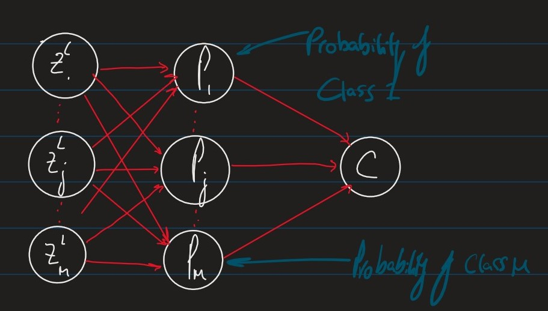

# Lecture 6

# Softmax

In [Lecture 5](../out/Neural-Comp-Lecture5.html) we derived the per-example cost function:

$$C_i = \sum_{j=1}^m\frac{1}{2}(y_j^{(i)} -a_j^L)^2 \tag{1}$$

where $a_j^L$ is the output of the model

Using the maximum likelihood method under the assumption that the predicted output $a_j^L$ has a Gaussian (normal) distribution. This assumption is acceptable for ***regression problems***

However, when we look at ***classification problems*** with $m$ discrete class labels $\{1,\cdots m\}$ it makes more sense to have one output unit $P_j$ per class, $j$ where $P_j$ is the probability of the example falling into class $j$

These units therefore have to satisfy the following conditions:

- $1 \geq P_j \geq 0 \forall j \in \{1\cdots,m\}$
- $\sum_{j=1}^mP_j = 1$

Diagrammatically, we replace the last layer of our network with a *"softmax"* layer

$$P_j = \frac{\mathcal{e}^{z_j^L}}{Q} \tag{2}$$

where: 

$$Q =\sum_{j=1}^m e^{z_j^L}\tag{3}$$

Here we use the exponential function to make certain that our probability stays positive and that the total probability doesn't exceed 1, a quick proof of this is as follows: 

$$\sum_{j=1}^m P_j = \frac{1}{Q}\sum_{j=1}^m e^{z_i^L} = \frac{Q}{Q} = 1 \tag{4}$$

Then, as we have bounded our probabilities, we can say:

$$P_y = P_{wb}(y|x) \tag{5}$$

i.e the probability of class, $y\in\{1,\cdots,m\}$ given input $x$

## Defining our loss function $\mathcal{L}$

Given $n$ independent observations $(x_1,y_1),\cdots, (x_n,y_n)$ where $y_i \in \{1,\cdots,n\}$ is the class corresponding to the input $x_i$, the likelihood of weigth and bias parameters $w,b$ is:

$$\mathcal{L}(w,b | (x_1,y_1),\cdots, (x_n,y_n)) = \prod_{i=1}^n P_{wb}(y_i | x_i) \\ = \prod_{i=1}^n P_{y_i} \tag{6}$$
<!-- 
When we have a continuous pdf we describe the probabilities with the product of the densities

When we have a discrete pdf we use the product of the probabilities -->

We can define a cost function using the maximum likelihood principal.

$$C = -\log \mathcal{L}(w,b | (x_1,y_1),\cdots,(x_n,y_n)) \\ 
= \frac{1}{n}\sum_{i=1}^n C_i \tag{7}$$

where:

$$C_i = -\log P_{wb}(y_i | x_i) \\ = -\log P_{y_i} \\ = \log Q - z_{y_i}^L \tag{8}$$

To apply gradient descent to minimise the cost function, we need to compute the gradients.

$$\frac{\delta C}{\delta w_{jk}^l} = \sum_{i=1}^n \frac{\delta C_i}{\delta w_{jk}^l} \tag{9}$$

$$\frac{\delta C}{\delta b_{j}^l} = \sum_{i=1}^n \frac{\delta C_i}{\delta b_{j}^l} \tag{10}$$

To compute these using backpropogation, we need to compute the local gradient for the softmax layer:

$$\delta_j^L := \frac{\delta C_i}{\delta z_j} \tag{11}$$

## Theorem

$$\delta_j^L = \frac{\delta C_i}{\delta z_j^L} = P_j - \delta_{y_ij}$$

where
$$\delta_{ab} =
\begin{cases}
1 & \text{if $a=b$} \\
0 & \text{otherwise}
\end{cases}$$

- This is also known as the *Kronecker-Delta function*

## Proof

$$\frac{\delta C_i}{\delta z_j^L} = -\frac{\delta\log P(y_i | x_i)}{\delta z_j} \\ 
= - \frac{\delta \log P_{y_i}}{\delta z_j} \\ 
= - \frac{\delta}{\delta z_j}\left( z_{y_i} - \log Q\right) \\ 
= - \left( \delta_{y_ij} - \frac{\delta \log Q}{\delta z_j}\right) \\
= - \left( \delta_{y_ij} - \frac{1}{Q}e^{z_j}\right) \\ 
= P_j - \delta_{y_ij} \\
\square \tag{12}$$

## Numerical Issues with Softmax

Neural networks are usually implemented with fixed length representations of real numbers. 
Obviously, these representations are finite representations of a uncountably infinite set $\R$

For instance, the maximal value of the `float69` data type in NumPy can represent is $\approx 1.8\times10^{308}$
When computing the numerator in $\frac{e^{z_j^L}}{Q}$ we can easily exceed this limit

### Note:

For any constant,$r$:

$$P_j = \frac{e^{z_j^L}}{\sum_k e^{z_k^L}} = \frac{e^r\cdot e^{z_j^L}}{e^r\cdot \sum_k e^{z_k^L}} = \frac{e^{z_j^L + r}}{\sum_k e^{z_k^L + r}} \tag{13}$$

To avoid too large exponents, it is common to implement the softmax function as the rightmost expansion above with the constant: 

$$r := -\max_k z_k^L \tag{14}$$

