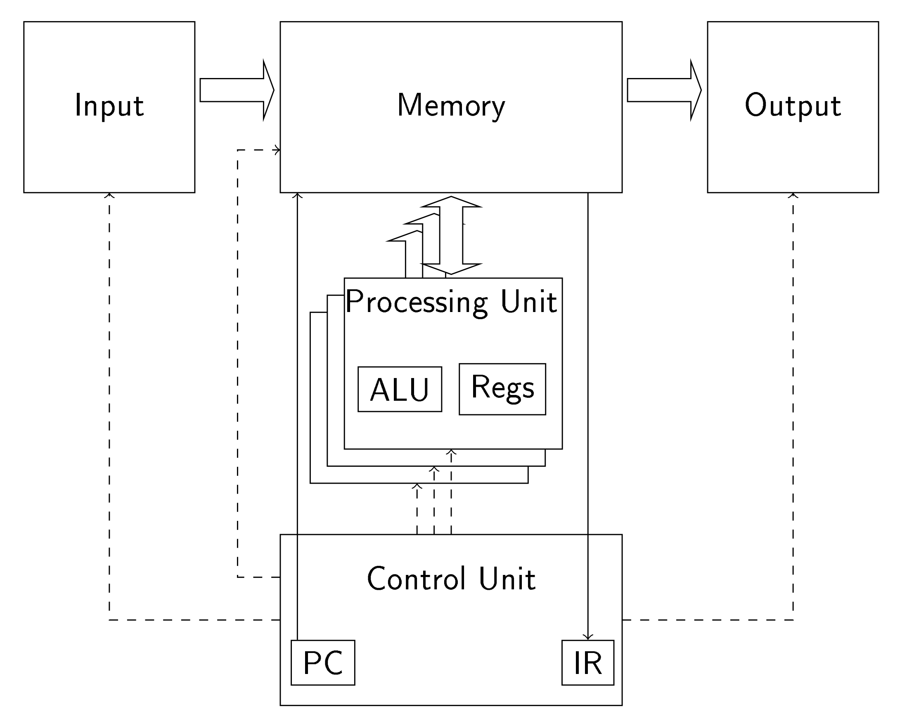

# Lecture 7

## 2 Types of Parallelism

- Task based
  - e.g. multiply or add
  - suitable for standard multi-core **CPUs** or networks of computers
    - i.e. have the same code running on multiple cores or **CPUs**
- Data based
  - e.g. alter an image by performing hte same operation on each pixel in parallel
  - Suitable for **GPUs**

## Latency vs. Throughput 

- Latency oriented processors
  - Minimises delay on **first** result being returned
  - e.g. if an operation takes 4 cycles, 10 operations will take 40 cycles
  - Large Caches to speed up memory access
    - Temporal/ Spacial locality, working sets
  - Complex control units
    - Short pipelines, branch prediction, data forwarding
      - to prevent pipeline stalls
  - Complex, energy expensive ALUs 
    - To minimise cycles to return a result.
  
- Throughput oriented processors 
  - Minimises delay on **all** results being returned
  - e.g. implement pipelined operation on ALUs, 10 cycles for first operation and to fill the pipeline but 1 cycles for all subsqeuent operations, total 19 cycles
  - Small caches
    - For *staging* data
      - get blocks of data at one time for a group of threads to work on
      - avoids each thread making separate fetches
  - Simple control units
    - No branch predction or data forwarding
    - The control is shared between threads working on different data
  - Simple, energy efficient ALU 
    - Long pipelines
    - Large number of cycles per operation but heavily pipelined
      - $\rightarrow$ long wait for first result as pipeline needs to be filled
        - but following results come quickly
      - Required large amount of threads to keep processor occupied


###### Fig. 1. Von Neumann Architecture
<div style="text-align:center"></div>

###### Fig. 2. Von Neumann Architecture for GPU 
<div style="text-align:center"></div>

## Compiling for CUDA

- The host CPU and GPU are separate devices connected by a bus
- Each have separate memory
- Therefore, we need to generate separate code for each device
  - The nvidia compiler for CUDA programs is `nvcc`
- `nvcc` takes *C/C++* code for with Nvidia extensions, separates and compiles the GPU code and passes the CPU code to the host to be compiled
- This results in a single binary with both CPU and GPU code, the GPU code is loaded onto it when the host runs this.


## VectorAdd - trivial example

$$\vec C = \vec A + \vec B$$ 

The sequential code for this may look like this:

```c
void vecAdd(float* h_A, float* h_B, float* h_C, int n){
    for (i=0; i<n ; i++){
        h_C[i] = h_A[i] + h_B[i];
    }
}
int main(){
    // declarations
    vecAdd(h_A,h_B, h_C, N);
    ...   
}
```

To write this for CUDA we must identify whether a function runs on the host, the device or both. 
We also have to work out where it should be callable from:

- the host: `__host__ void f(...)`
  - This is default so can be omitted 
  - Callable from the **host only**
- The device: `__global__ void f(...)`
  - special functions called **kernel functions**
  - callable from **host only**. This is how we run code on the GPU
- The device: `__device__ void f(...)`
  - callable from the **device only**. they are helper functions 
- both: `__host__ __device__ void f(...)`

## CPU computational unit structure

- When we call a kernel function we need to specify how the threads should be organised to execute it
  - Every thread is going to exectue the same kernel.
  - Different CPU devices can support different numbers of simultaneously executable threads
  - Within a GPU thread structure is **not** uniform, i.e. do not have equal access to all the GPU memory, syncronise with other processing units or share cache memory

## CUDA thread issues

- We don't want the fixed number of GPU threads to dictate the size of the largest vectors we can add
- We don't want to have to change our code to run on different GPUs
- We need to organise our threads to co-locate groups of threads on sets of processing units to take advantage of shared caches and syncronisation facilities
- NVidia GPUs accomplish this by organising threads into a hierarchical structure
  - A *Grid* is a collection of *Blocks*
  - A *Block*  is a collection of *Threads*
  - A *Thread* is the execution of a *kernel* on a single processing unit

## CUDA thread organisation

Outside the *Grid/Block/THread* hierarchy, there is the concept of a *Warp*

- A *Warp* is a set of a number of tightly related threads that must execute fully in lock step with each other.
- Warps are not part of CUDA but are on all modern Nvidia GPUs, dictated by low level hardware design
- The number of threads in a *warp* is a feature of a particular GPU, but is most commonly 32
- Warps are the low-level basis of thread scheduling on a GPU, if a thread is scheduled to execute, so are all other threads in the *warp*
- As they execute the same instructions in lock step, all threads in a *warp* will have the same instruction timing

- A block can have a size between 1 and the number of threads on the GPU. (typically 2014) and is the high-level basis of thread scheduling
- Because of the nature of *warps*, the block size should be a multiple of the *warp* size
- Grids can have large numbers of blocks, many more than can be concurrently executed. 

## Invoking Kernel Functions 

- We need to specify the grid/block structure hwen invoking a kernel function

```c
...
int threadsPerBlock = 256;
int blocksPerGrid = 1 + (numElements - 1) / threadsPerBlock;
vectorAdd<<<blocksPerGrid, threadsPerBlock >>>(d_A, d_B, d_C, numElements);
...
```

**Note `<<<blocksPerGrid, threadsPerBlock >>>` is not standard C/C++ and is handled by `nvcc`**

## Inside Kernel Functions

Each thread needs to know which part of the data to work on.
CUDA provides predefined variables for this purpose:

- `blockIdx.x` the unique identifier for this block in this grid
- `blockDim.x` the number of threads in a block for this grid 
- `threadIdx.x` the unique identifier of this thread in this block

```c
__global__ void 
vectorAdd(const float *A, const float *B, float *C, int n){
    int i = blockDim.x * blockIdx.x + threadIdx.x;

    if (i < n){
        C[i] = A[i] + B[i];
    }
}
```

## Grid and Block Dimensionalities 

- Grids and Blocks can be organised as 1D, 2D or 3D spaces
- Hence the predefined variables `blockIdx.x, blockDim.x, threadIdx.x` have `.y` and `.z` variants
  - If you are using 1D grids and blocks then you can ignore these.

## Device Global Memory 

- GPU memory is **not** shared with the host. Therefore, the host has to copy data to the device and copy s back when the kernel finishes.
- Before doing this, the host must allocate global memory on the device and, afterwards, free it again, like `malloc` and `free`.
  - **Note: the return of `cudaMalloc` is an error number**

```c
float *h_A = (float *)malloc(size);
float *h_B = (float *)malloc(size);
float *d_A = NULL;
err = cudaMalloc((void **)&d_A, size);
float *d_C = NULL;
err = cudaMalloc((void **)&d_C, size);
...
err = cudaMemcpy(d_A,h_A, size, cudaMemcpyHostToDevice);
... // Invoke kernel
err = cudaMemcpy(h_c,d_C, size, cudaMemcpyDeviceToHost);
...
err = cudaFree(d_A);
err = cudaFree(d_C);
```
**Note: this code is for a slightly different example, use it only as an example of `cuda<method>` methods**

## CUDA Error Handling 

The only way to check hat things are working correctly on the GPU is the check the error return values. **Check them every time**

```c
if (err != cudaSuccess){
    // handler
}
```

- Kernel functions don't return error numbers. However, after it has finished you can call `err = cudaGetLastError();` to get the error number if one occurred.
- Since kernel functions can run in parallel with host functions, if ou call `cudaGetLastError()` before the kernel function finishes, the rror may only occur after you requested the error.
- If you really want to avoid this call `cudaDeviceSyncronize()`
  - But avoid this as it is very inefficient.

## TIming Host Code with Host Timers

- Typically we want to time both the sequential code (on the host) and the parallel code (on the GPU). 
  
- The general approach to time the **Host** code is:

```c
# include <cuda_runtime.h>
# include <helper_cuda.h>
# include <helper_functions.h>

StopWatchInterface *timer = NULL;
sdkCreateTimer(&timer);
sdkStartTimer(&timer);

/* The Host code that is to be timed*/

sdkStopTimer(&timer);
double h_msecs = sdkGetTimerValue(&timer);
sdkDeleteTimer(&timer);

```

- In general do **NOT** use host timers to time GPU code. They are much less accurate.
- However, if you **have to** time the **Host and GPU** code using host timers the pattern is:


```c 
# include <cuda_runtime.h>
# include <helper_cuda.h>
# include <helper_functions.h>

StopWatchInterface *timer = NULL;
sdkCreateTimer(&timer);
sdkStartTimer(&timer);

/* Host + GPU code that is to be timed */

cudaDeviceSyncronize();

sdkStopTimer(&timer);
double h_msecs = sdkGetTimerValue(&timer);
sdkDeleteTimter(&timer);

```
- The best way to time GPU code is to insert an **event** into the GPU execution stream before and after the code to time and get the elapsed time form them.

```c 
cudaEvent_t start, stop;
float m_secs; 
cudaEventCreate(&start);
cudaEventCreate(&stop);

cudaEventRecord(start ,0);

/* Call GPU kernel(s) */

cudaEventRecord(stop, 0);
cudaEventSyncronize(stop);

cudaEventElapsedTime(&d_msecs, start, stop);
cudaEventDestroy(start);
cudaEventDestroy(stop);
```