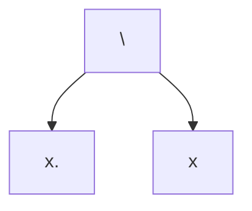
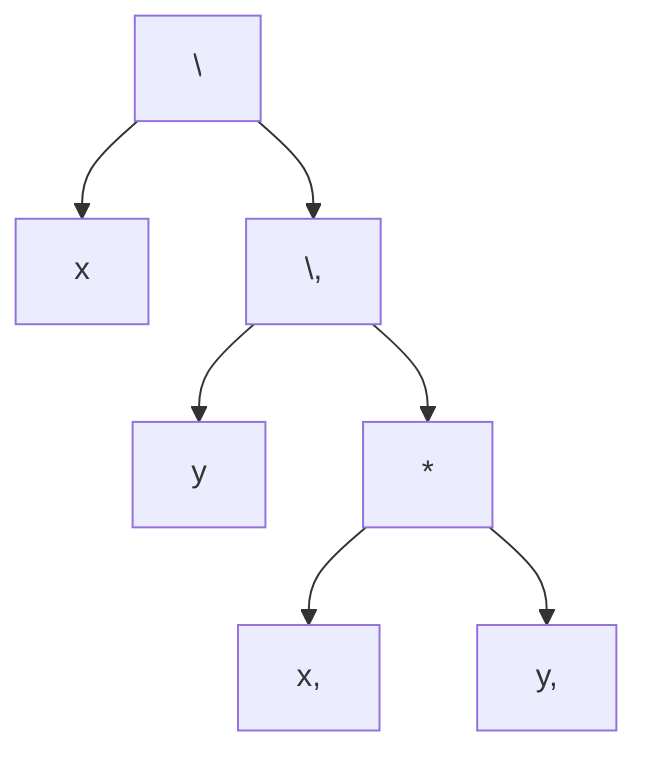
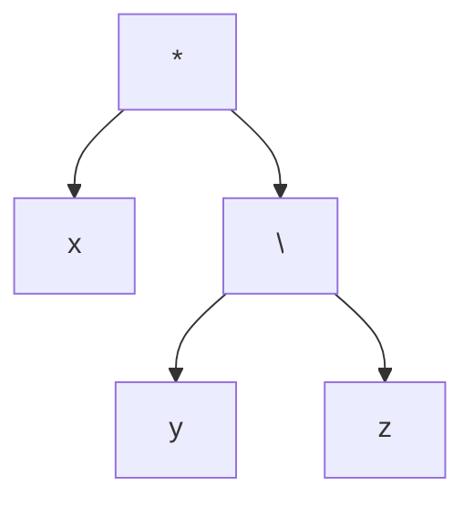
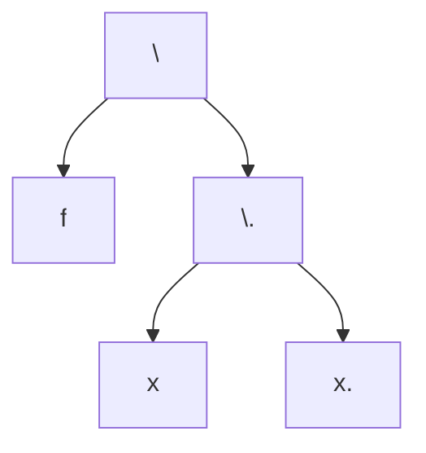
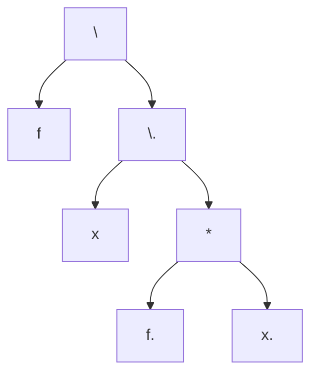
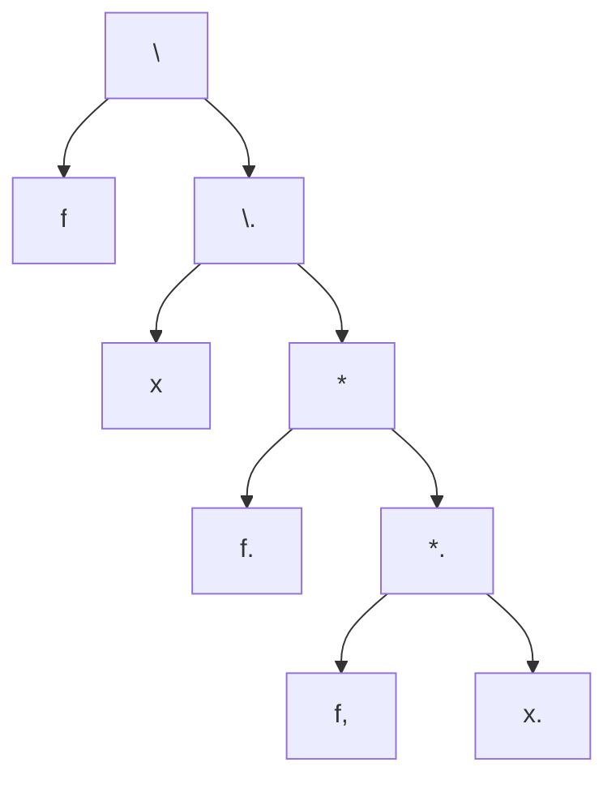

# Introduction to the Untyped $\lambda$-Calculus

## Key Points:

- Syntax
- Variables 
- Substitution
- $ \alpha$-conversion
- $ \beta $-reduction
- Fixpoint combinators

The untyped $\lambda$-Calculus is the smallest universal programming language first developed by Alonzo Church in 1932.

It has the same expressive power as Turing machines. It lends itself more the the study of properties of computation than Turing machines do. 

The $\lambda$-Calculus contains terms (syntax) and rules to compute terms

## Syntax

The $\lambda$-Calculus has only 3 constructs:

1. Variables
2. Functions
3. (Function) Applications

### Formal definition 

let $ \mathcal{V} $ be a set of variables
let $x,y,z,\ldots$ range over $\mathcal{V}$

The following Backus-Naur form inductively defines the syntax:

$$ M ::= x | \lambda x.M | M M  $$ 

**terms can be surrounded with parenthesis in ambiguous cases

A $\lambda$-term $ \lambda x.M $ is an _anonymous function_, also known as a $\lambda$ abstraction. It has 1 parameter $x$ with a body $M$

Applications of the form $M N$ are used to pass arguments to functions 

**we sometimes write $\lambda x_1,\ldots,x_n.M$ instead of $\lambda x_1 \ldots \lambda x_n.M$**

**Officially a function with 1 parameter would take the form $\lambda x.M$ and a function with 2 parameters would take the form $\lambda x. \lambda y.M$**

We use brackets to remove ambiguity but in general, our precedence rule is that application has higher precedence over $ \lambda $
We also use an associativity rule, application is **left** associative, i.e: $xyz$ stands for $(xy)z$ 

---
Exercise:

Write parentheses appropriately around all lambda as applications:

1. $ \lambda x.\lambda y.xy $

$ (\lambda x.(\lambda y.(xy))) $

2. $ \lambda x.x\lambda x.xx$

$ (\lambda x.(x(\lambda x.(xx))))$

3. $ \lambda x.xx\lambda x.x $

$(\lambda x.((xx)(\lambda x.x))) $

---

### Implementation of Types in the $\lambda$-Calculus

#### Boolean

T = $ \lambda x.\lambda y.x $
F = $ \lambda x.\lambda y.y $
$\texttt{and} = \lambda a.\lambda b.a b F$
$ \texttt{or} = \lambda a.\lambda b.a T B $
$ \texttt{not} \lambda x.a F T $ 

#### Numbers (Church Numerals)

$ \underline{0} = \lambda f . \lambda x.x $
$ \underline{1} = \lambda f.\lambda x . f x $
$ \underline{2} = \lambda f.\lambda x . f (f x) $
$\cdots$
$ \texttt{succ} = \lambda a . \lambda f .\lambda x.f (a f x)$
$ \texttt{add} = \lambda a. \lambda b \lambda f.\lambda x.a f x (b f x) $

essentially with x being a base case (0) each application of $f$ represents another successor

### Abstract Syntax Trees

We can use these rules to derive trees where:
-  leaves are variables
- nodes are either
    - application nodes (labelled with @)
    - lambda nodes (labelled $ \lambda  $)

We refer to these trees as _abstract syntax trees_ 

### Examples

$ \lambda x.x $

$ \lambda x.\lambda y.xy $

$ x(\lambda y.z) $

--- 
Exercise

What are the abstract syntax trees corresponding to:

$ \lambda f.\lambda x.x $

$ \lambda f.\lambda x.\lambda x $

$ \lambda f.\lambda x.f(fx) $

---

## Free and Bound Variables

Given a $\lambda$- term, $ \lambda x.M $
- $x$ is the parameter of the function
- the _scope_ of $x$ is the body $M$ 
- the $ \lambda  $-abstraction binds the _"free"_ occurrences of $x$ in $M$ 

A variable $x$ is either 
- **bound** if it is i the scope of a $\lambda$ abstraction with a parameter $x$ e.g $ \lambda x.x $
- *free*, otherwise e.g. $ \lambda y.yx $

$x$ can occur both free and bound in some cases: $ x(\lambda x.x) $

We say that the occurrence of a bound variable $x$ is bound to a $\lambda$ in a term $M$, fi the corresponding $\lambda$-abstraction is the _smallest_ $\lambda$-abstraction in $M$ with parameter $x$ containing that bound occurrence

For example:
$$ (\lambda x.x)(\lambda x.x) $$ 

- $x$'s $ 2^{nd}$ occurrence is bound to the $ 1^{st}$ $\lambda $
- $x$'s $ 4^{th}$ occurrence is bound to the $ 2^{nd}$ $\lambda $

The set of free variables occurring in a term is recursively computed as:

$$ FV(x) = \{x\} \\ FV(\lambda x.M) = FV(M) \ \{x\} \\ FV(M N) = FV(M) \cup FV(N)$$ 

We can then say a variable $x$ occurs free in $M$ iff $x \in FV(M)$

A term $M$ is **closed** if $FV(M) = \empty$

## $\alpha$-equivalence

>Bound variable names are not important and can be renamed without changing the meaning of a term

Two terms $M$ and $N$ are **$\alpha$-equivalent** - denoted $M \equiv_{\alpha} N$ if they only differ by their bound variables, i.e
- $M$ and $N$ have the same tree structure up to the leaves
- $M$ and $N$ have the same occurrences of free variables
- one superscript assignment can be used to label both $M$ and $N$

> TODO Finish