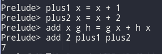
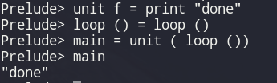
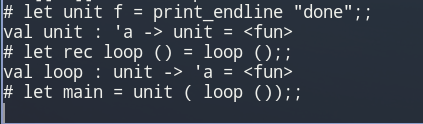

# Lecture 1

## Functional Programming

Functional is a term used to denote a language where functions are *first class*, whereby they can be used in the same ways as a more primitive data type. 
Functional languages also evaluate **expressions** rather than execute **instructions**

### Haskell Example


```haskell
plus1 x = x + 1
plus2 x = x + 2 
add x g h = g x + h x
main = print ( show ( add 2 plus1 plus 2))
```

Here you can see we define two functions `plus1` and `plus2` which take a single (integer) parameter. We then define `add` which takes a value `x` along with 2 parameters which are functions. We then pass our functions `plus1` and `plus2` as parameters into this expression which evaluates to 7.




## Classes of functional Languages

### Purity

A functional language is said to be _pure_ when it **cannot** have side effects.

Haskell is widely considered to be pure whereas OCaml is not.

Pure programs are easier to debug, maintain and reason about. They also handle concurrency better in most cases.

### Laziness 

A programming language can be said to be _lazy_ or _eager_. This distinction refers to their evaluation strategy. 

Lazy languages do not evaluate expressions until they are needed, whereas eager languages evaluate them beforehand.

Haskell is an example of a lazy language and OCaml is eager by default.

For example the following code terminates in Haskell:



but does not in OCaml



This happens due to their differing evaluation strategies. When we apply `loop`, which will never terminate in either language, to `unit` in Haskell, Haskell realises that `f` is never used and $\therefore$ does not need to be evaluated. OCaml however, _eagerly_ tries to evaluate `loop` and in so doing gets stuck infinitely.

### Static Typing

In statically typed languages, expression have types that are checked at compile-time. Programs with type errors will fail at compile-time (rather than runtime). 
Both Haskell and OCaml are statically typed. Lisp is dynamically typed

```haskell
add1 :: Integer -> Integer
add1 x = x + 1
```

is accepted by the haskell compiler but:

```haskell
addT x = x + True
```
 
is not, as Haskell realises that we are trying to use `+` on an `x` of type T and a boolean when the addition operator is defined on integers.

## Introduction to Haskell

Haskell is a _"mostly pure"_ lazy functional programming language

_see_ `h2.hl`  

## The $\lambda$-Calculus

We will also be looking at the $\lambda$-Calculus, a very simple functional programming language.

Like turing machines, the $\lambda$-Calculus is a model of computation.

There are only 3 constructs in the $\lambda$-Calculus:

$$ M ::= x | \lambda x.M | M M \tag{ 1 }$$ 

It allows for the creation and application of (anonymous) functions.
