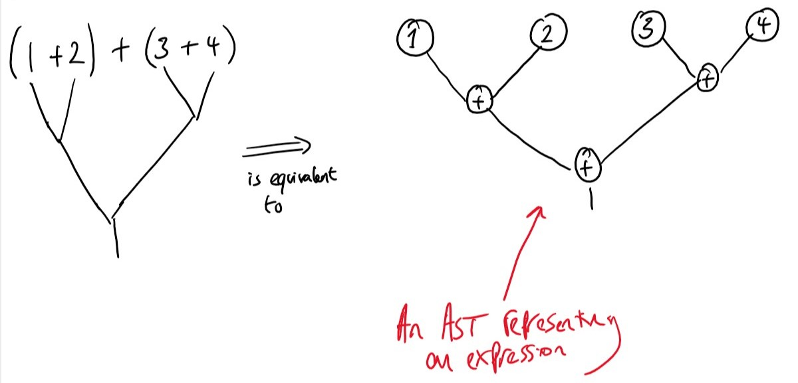
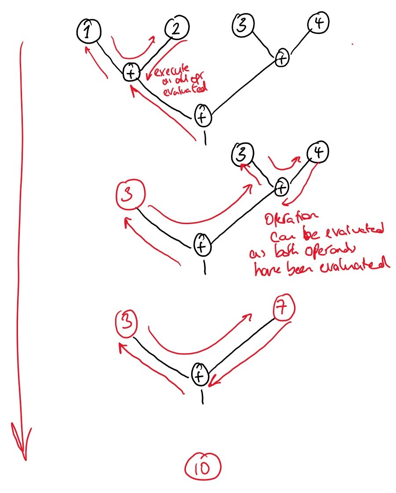
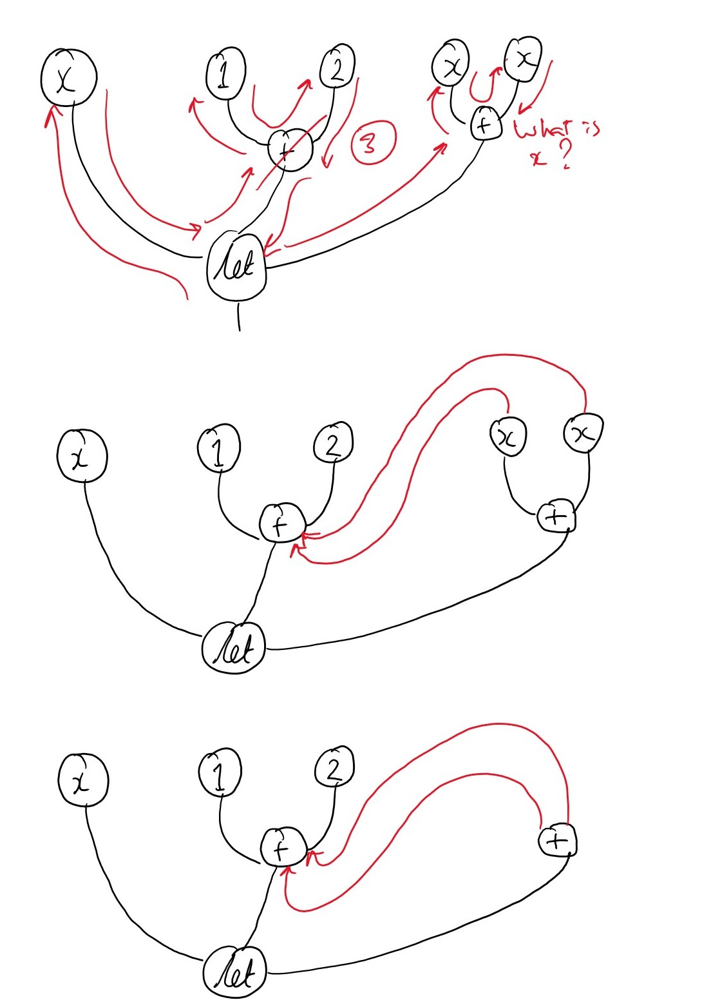
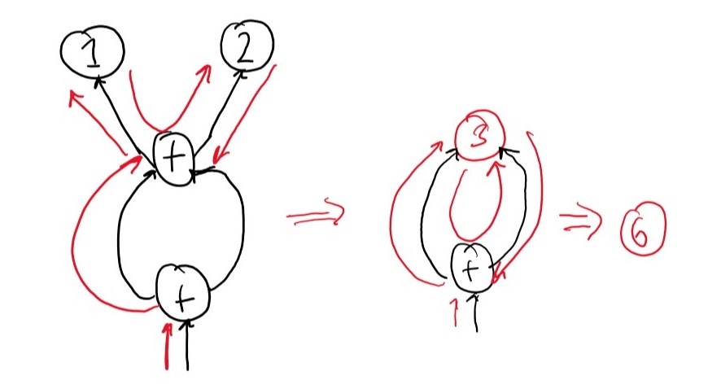

# Lecture 4: Abstract Syntax Graphs



We represent evaluation order in a AST by using a _fixed depth first first search from left to right_. I.e. we traverse the tree from bottom up, left to right. Once we have evaluated all operands of an operator we can evaluate the operator and continue right. We repeat this until we are left with a value. 





This approach does however, have some disadvantages for example:

```OCaml
let x = 1 + 2 in x + x 
```




When we hit a variable `x` we have to backtrack through the tree to find the definition of the variable before we can evaluate.

To solve this we incorporate variable pointers into our structure. In so doing, we destroy the Tree structure of our representation, replacing it with a Directed Acyclic Graph (DAG) or Abstract Syntax Graph. Which can be better represented as:



This conversion can happen at compile time, meaning such a representation has little to no effect on runtime performance.