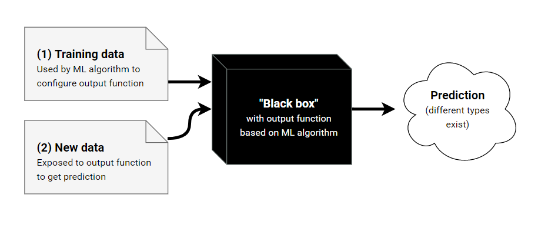

# Lecture 2

## Linear Regression Models

### Cat Hearts example:

#### Experience $E$

- The dataset consists of $n$ data points 
  - $((x_1,y_1),...,(x_n,y_n)\in \R^d\times \R)$
  - $x_i \in \R^d$ is the *"input"* for the $i^{th}$ data point as a feature vector with $d$ elements, $d$ being the # of dimensions in the feature space, in this case 1.
  - $y_i \in \R$ is the *"output"* for the $i^{th}$ data point, in this case the weight of the corresponding cat heart.

#### Learning Task, $T$

- In this example, our task is: **Linear Regression**
- Find a *"model"*, i.e. a function:
  - $f : \R^d \rightarrow \R$
- s.t. our future observations produce output *"close to"* the true output.

##### Linear Regression Model

- A linear regression model has the form: 
  - $f(x) = (\sum_{i=1}^{d}w_i \cdot x_i)+ b$
  - where:
    - $x \in \R^d$ is the input vector (feature)
    - $w \in \R^d$ is the weight vector (parameters)
    - $b \in \R$ is a bias (parameter)
    - $f(x) \in \R$ is the predicted output

___

- In our cat example we have: 
  - $d=1$ as "body weight" is our only feature
  - $b=0$ as from intuition we expect a cat of 0 weight to have a heart of 0 weight.
  - Our model has one parameter: $w$ 

#### Performance Measure, $P$

- Want a function, $J(w)$ which quantifies the error in the predictions for a given parameter $w$

- The following empirical loss function, $J$ takes into account the errors $\forall n$ data points.
  - $J(w) = (1/2N)\sum_{i=1}^N(y_i-wx_i)^2$
  - where the summation term is squared so that:
    - we ignore the sign
    - we penalise large errors more
- To find the optimum weight, solve:
  - $\frac{\delta J}{\delta w}$ = 0 

#### Unconstrained Optimisation (Minimisation)

Given a continuous function:

- $f: \R^d \rightarrow \R$ , as our *loss function*
- an element $x \in \R^d$ is called:
  - A **global** minimum of $f$ iff: 
    - $\forall y \in \R^d, f(x) \leq f(y) $
  - A **local** minimum of $f$ iff:
    - $\exists \epsilon > 0, \forall y \in \R^d$ if $\forall i \in \{1,...,d\} , | x_i - y_i | < \epsilon \implies f(x) \leq f(y)$

___
**Theorem: 
For any continous function, $f: \R \rightarrow \R$, if $x$ is a local optimum, $f'(x) = 0$**
___

**Definition:
The $1^{st}$ derivative of a function $f: \R \rightarrow \R$ is 
$f'(x) = \lim_{\Delta x \rightarrow 0}\frac{f(x+\Delta x) - f(x)}{\Delta x}$**

##### Differentiation Rules

1. $(cf(x))' = cf'(x)$
2. $(x^k)'$ = $kx^{k-1}$, if $k \neq 0$
3. $(f(x)+g(x))' = f'(x) + g'(x)$
4. $(f(g(x))'  = f'(g(x))g'(x))$ $\leftarrow$ **chain rule**

##### Approach 1: Ordinary least squares
  
- Optimise $J$ by solving $J'(w) = 0$
  - $J(w) = \frac{1}{2N}\sum_{i=1}^N(y_i - wx_i)^2$
  - $J'(w) = \frac{1}{N}\sum_{i=1}^{N}(wx_i - y_i)x_i$
  - $J'(w) = 0$
    - $\frac{1}{N}\sum_{i=1}^{N}(wx_i - y_i)x_i = 0$
    - $w\sum_{i=1}^{N}(x_i)^2 = \sum_{i=1}^{N}x_iy_i$
    - $w = \frac{\sum_{i=1}^{N}x_iy_i}{\sum_{i=1}^{N}x_i^2}$
      - This only has one solution $\therefore$ a global minimum. 

##### Approach 2: Gradient descent

- Often difficult / impossible to solve $J'(w) = 0$ for non-linear models with many parameters

**Idea:**

- Start with an initial guess
- While $J'(w) \neq 0$:
  - move *slightly* in the *right direction*

- To make this viable we need to define:
  - *"what is the right direction?"*
  - *"what is slightly?"*

###### Attempt 1 **(failed)**

$ w \leftarrow initial \ weight $
repeat: 
&nbsp;&nbsp;&nbsp;&nbsp;&nbsp;&nbsp; if $J'(w) < 0 $
&nbsp;&nbsp;&nbsp;&nbsp;&nbsp;&nbsp;&nbsp;&nbsp;&nbsp;&nbsp;&nbsp;&nbsp; $  w \leftarrow w + \epsilon $
&nbsp;&nbsp;&nbsp;&nbsp;&nbsp;&nbsp; elseif $J'(w) > 0$
&nbsp;&nbsp;&nbsp;&nbsp;&nbsp;&nbsp;&nbsp;&nbsp;&nbsp;&nbsp;&nbsp;&nbsp; $w \leftarrow w - \epsilon$ 

- where $\epsilon$ is the learning rate set manually. **(hyper-parameter)**

**Issue with this attempt:**

- w may oscillate in the interval $[w_{opt} - \epsilon, w_{opt}+ \epsilon]$
- w fails to converge 

###### Attempt 2: Gradient Descent (1D)

$ w \leftarrow initial \ weight $
repeat: 
&nbsp;&nbsp;&nbsp;&nbsp;&nbsp;&nbsp; if $J'(w) < 0 $
&nbsp;&nbsp;&nbsp;&nbsp;&nbsp;&nbsp;&nbsp;&nbsp;&nbsp;&nbsp;&nbsp;&nbsp; $  w \leftarrow w - \epsilon \cdot J'(w)$