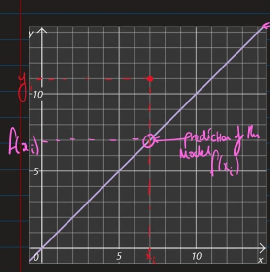

<!-- @import "[TOC]" {cmd="toc" depthFrom=1 depthTo=6 orderedList=false} -->

<!-- code_chunk_output -->

- [Lecture 2](#lecture-2)
  - [Linear Regression Models](#linear-regression-models)
    - [Cat Hearts example:](#cat-hearts-example)
      - [Experience $E$](#experience-e)
      - [Learning Task, $T$](#learning-task-t)
        - [Linear Regression Model](#linear-regression-model)
      - [Performance Measure, $P$](#performance-measure-p)

<!-- /code_chunk_output -->
# Lecture 2

## Linear Regression Models

### Cat Hearts example:

#### Experience $E$

- The dataset consists of $n$ data points 
  - $((x_1,y_1),...,(x_n,y_n)\in \R^d\times \R)$
  - $x_i \in \R^d$ is the *"input"* for the $i^{th}$ data point as a feature vector with $d$ elements, $d$ being the # of dimensions in the feature space, in this case 1.
  - $y_i \in \R$ is the *"output"* for the $i^{th}$ data point, in this case the weight of the corresponding cat heart.

#### Learning Task, $T$

- In this example, our task is: **Linear Regression**
- Find a *"model"*, i.e. a function:
  - $f : \R^d \rightarrow \R$
- s.t. our future observations produce output *"close to"* the true output.

##### Linear Regression Model

- A linear regression model has the form: 
  - $f(x) = (\sum_{i=1}^{d}w_i \cdot x_i)+ b$
  - where:
    - $x \in \R^d$ is the input vector (feature)
    - $w \in \R^d$ is the weight vector (parameters)
    - $b \in \R$ is a bias (parameter)
    - $f(x) \in \R$ is the predicted output

___

- In our cat example we have: 
  - $d=1$ as "body weight" is our only feature
  - $b=0$ as from intuition we expect a cat of 0 weight to have a heart of 0 weight.
  - Our model has one parameter: $w$ 

#### Performance Measure, $P$

- Want a function, $J(w)$ which quantifies the error in the predictions for a given parameter $w$

- The following empirical loss function, $J$ takes into account the errors $\forall n$ data points.
  - $J(w) = (1/2N)\sum_{i=1}^N(y_i-wx_i)^2$
  - where the summation term is squared so that:
    - we ignore the sign
    - we penalise large errors more
- To find the optimum weight, solve:
  - $\frac{\delta J}{\delta w}$ = 0 

