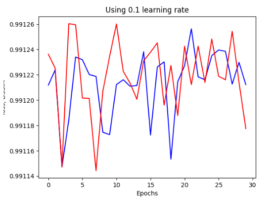

---
html:
  embed_local_images: false
  embed_svg: true
  offline: false
  toc: undefined
#   path: ../out/

export_on_save:
  html: true
---

# Lecture 8

## Repetition: Gradient Descent

In gradient descent we have an input of a cost function, $\mathcal{J}$ and a learning rate, $\varepsilon$

$$
\mathcal{J} : \R^m \rightarrow \R
$$

The pseudo-code for conventional gradient decent is as follows:

foo

$$
x\leftarrow \text{some initial point in } \R^m \\
\text{while termination condition not met} \\ \{ \\
    x \leftarrow x - \varepsilon \cdot \nabla \mathcal{J}(x) \\ 
\}
$$

### Impact of learning rate $\varepsilon$ on Stochastic Gradient Descent

- Learning rate in SGD can have a marked impact on the optimisation time of a network
- Often necessary to vary/ adjust the learning rate according to the specific model you are training.

- If a learning rate that is too high is used then the model parameters vary wildly causing a large variance in the value of the loss function, $\mathcal{J}$

- If too low a learning rate is used then the model stagnates far from the optimum conditions, it may converge given enough epochs but this would take exponentially long relative to the size of the learning rate

## Gradient Descent with Momentum 

$$
\text{Choose initial parameter, } \Theta \\
v = 0  \\
\text{while termination condition is not met} \\ \{ \\
v = \alpha v - \mathcal{E}\nabla_{\Theta}C(\Theta) \\
\Theta = \Theta + v \\ \}
$$

Conceptually, we can think of momentum in this context the same as in physics:

> A Ball with position $\Theta$ and a velocity $v$ influenced by two forces, one which pushes the ball in the opposite direction of the current gradient, and a     viscous drag determined by a parameter $\alpha < 1 $

The momentum *smooths out* the update steps. The size of the updates is proportional to how similar the previous gradients are.

### Two Hyper-parameters

- $\varepsilon \leftarrow$ learning rate
- $\alpha \leftarrow$ Factor which determines the influence of the past gradients on the current update of the parameter, typical values include 0.5, 0.9 or 0.99

## Nesterov Momentum 

$$
\text{Choose an initial parameter, } \Theta \\
v = 0 \\
\text{While termination condition is not met}\\ \{ \\
v = \alpha v - \varepsilon\nabla C(\Theta+ \alpha v ) \\
\Theta = \Theta + v \\
\}
$$

Nesterov Momentum is a variant of standard momentum where the gradient is computed after the velocity is applied

## Adagrad

> Duchi et al. 2011

$$
\text{choose an initial parameter, } \Theta \\
r = 0 \\
\text{while termination condition is not met} \{ \\
g = \nabla_{\Theta}C(\Theta) \\
r = r + g \odot g \text{$\leftarrow$ *Squared gradient* } \\
v = \frac{\varepsilon}{\delta + \sqrt{r}} \odot g \\
\Theta = \Theta + v 
$$

Where $\delta$ is a hyperparameter, typically around $10^{-6}$

Adagrad adapts a (possibly differing) *learning rate* $\frac{\varepsilon}{\delta + \sqrt{r}}$ for each dimension according to accumulated square gradient, $r$ 

- Large $r \implies$ small $\frac{\varepsilon}{\delta + \sqrt{r}}$
- Small $r \implies$ large $\frac{\varepsilon}{\delta + \sqrt{r}}$

**AdaGrad works well for problems with sparse gradients**

All gradients are weighted equally by $r$ 

## Adam 

> Kingma and Ba, 2014

$$
\text{Choose an initial parameter, } \Theta \\
r = 0, s = 0, t = 0 \\
\text{while termination condition not met} \{  \\
t += 1  \\
g = \nabla_{\Theta} C(\Theta) \\
s = \rho_1s + (1-\rho_1)g \\
r = \rho_2r + (1-\rho_2)g\odot g \\
\overset{n}{s} = \frac{s}{1-\rho_1^t} , \overset{n}{r} = \frac{r}{1-\rho_2^t} \\
v = -\varepsilon \cdot \frac{\overset{n}{s}}{\sqrt{\overset{n}{r}}+ \delta} \\
\Theta = \Theta + v
$$

Here $v$ is defined as the average gradient divided by the average squared gradient

Typical hyperparameter values are as follows: 

- $\varepsilon = 0.001$ 
- $\rho_1 = 0.9$
- $\rho_2 = 0.999$
- $\delta = 10^{-8}$

