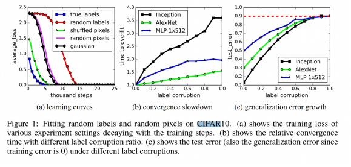

# Lecture 9

Previously, we looked at different optimisation algorithms.

## Generalisation in Neural Networks

Hypothesis:

> Neural Networks generalise from the training data, i.e. by learning the inherent *structure* in the data.
 
Test of Hypothesis: removing structure should reduce network performance

Zhang et al. (ICLR 2017) trained a network over the CIFAR10 dataset with the following settings:

- True labels, original training set **(ground)**
- Random labels: all labels are replaced with random ones
- Shuffle pixels: a random permutation of the pixels for each image
- Gaussian: A gaussian distribution is used to generate random pixels for each image

- Deep neural networks easily fit random labels 
- The effective capacity of neural networks is sufficient for memorising the entire dataset
- Training time increases only by a small constant factor

## Perceptrons

These were a very early form of artificial networks and are comparatively very weak to current approaches

$$
f(x) = \text{sign}(w^Tx - b) \\
\text{where, }\\
\text{sign}(x) = \begin{cases} 1 & \text{if} x > 0 \\ -1 & \text{otherwise}\end{cases}
$$

### Linear decision Boundary 

The boundary between positive and negative output of a single layer perceptron , can be described by a linear hyper-plane

For example, in 2D we get: 
$$
f(x_1,x_2) = \text{sign}(w_1x_1 + w_2x_2 - b)
$$
$$
w_1x_1 + w_2x_2 - b < 0 \implies x_2 > \frac{b-w_1x_1}{w_2}
$$

@import "../resources/l9graph.png"

### Minsky & Papet (1969)

> **A single layer perceptron cannot learn the XOR function**

- Caused controversy and led to the *"AI Winter"*
  $\implies$ Reduced research funding to Neural Network research
  $\implies$ Reduced interest among researchers

### Lebesgue Integration

THe *Lebesgue* Integral

$$
\int f(x) d\mu(x)
$$
 
This is an alternative to the *Riemann* Integram which is defined for more complex functions, $f$. 
It is defined with respect t a measurement $\mu$ which measures the *size* of subsets of the domain of $f$

It can be defined as:

Given $f: x \rightarrow \R$, let
$$
f^*(t) = \mu(\{x | f(x)>t\})
$$
then,

$$
\int f(x)d\mu(x) = \int_0^{\infin} f^*(t)d(t)
$$

where the LHS is the *Lebesgue* Integral and the RHS is the *Riemann* Integral

### Discriminatory Functions

<u>Definition:</u>

$\sigma : \R \rightarrow \R$ is called discriminatory iff 

$$
\int_{I_N} \sigma (y^{T}x+\Theta)\delta \mu(x) = 0 \\
\forall y \in \R^N \text{ and } \Theta \in \R \implies \mu =0
$$

<u>Lemma</u>

Any function $\sigma: \R \rightarrow \R$ where:

$$
\sigma (x) = \begin{cases}
    1 & \text{for    } x\rightarrow \infin \\
    0 & \text{for    } x \rightarrow -\infin
\end{cases}
$$

is discriminatory

For example, the Sigmoid function $\sigma(x) = \frac{1}{1+e^{-x}}$ is discriminatory

### Theorem (Cybenko, 1989)

Let $\sigma$ be any continuous discriminatory function, then for any function $f \in C(I_N)$ i.e continuous function on $I_N = [0,1]^N$ and any $\varepsilon > 0$ then there exists a finite sum of the form:

$$
G(x) = \sum_{j=1}^{M}\alpha_j\sigma(w_j^Tx + \Theta_j)
$$

s.t.

$$
|G(x) - f(x)| < \epsilon, \forall x \in I_m
$$

@import "../resources/l9theorem.png"

<u> Definition: Normed Linear Space </u>

A Normed Linear Space is a vector space $X$ over $\R$ and a function $\|.\|: X \rightarrow \R$ satisfying the following:

1. $\| x\| \geq 0, \forall x \in X$
2. $\|x\| = 0, \iff x=0$
3. $\|\alpha x\|= |\alpha|\cdot\|x\|, \forall \alpha \in \R \And x \in X$
4. $\| x+y\| \leq \|x\| + \|y\|, \forall x,y \in X$

<u>Definition Supremum Norm </u>

$$
\| f\| := \text{smp}\{|f(x)|  \bigg\vert x\in X \}
$$

We can now measure the *distance* between two functions $g$ and $f$ by

$$
\| f-g\|
$$

<u> Closure </u>

Let $Y$ be a subset of a normed vector space $X$. The closure of $Y$, $\bar{Y}$, consists of all $x\in X$ s.t. for each $\varepsilon>0$, we can find an element $y\in Y$ s.t.

$$
\| y-x\| < \varepsilon
$$

For example the closure of the set of rational numbers, $\mathbb{Q}$, is the set of real numbers, $\R$.

<u> Defininition </u>

A linear function on a real vector space, $X$ is a function $L: X \rightarrow \R$ s.t.

1. $L(x+y) = L(x) + L(y), \forall x,y\in X$
2. $L(\alpha x) = \alpha L(x), \forall x\in X, \alpha \in \R$

<u>Theorem</u>

Let $(X, \|.\|)$ be a normed linear space, $Y$ can be a subspace of $X$ and $f\in X$

if ??$t$?? does not belong to the closure of $Y$ then there exists a bounded linear functional $L:X\rightarrow \R$ s.t.

$$
L(x) =0 \text{ if } x\in Y, \text{and} \\
L(f) \neq 0
$$

<u>Proof</u>

Let $\text{SCC}(I_N)$ be the set of functions that can be described on the form $k$. 
The statement of the theorem is equivalent to the claim that the closure of $S$ = $C(I_N)$
Assume by contradiction that the closure of $S$ is a strict subset, $R$ of $C(I_N)$

It follows by the previous theorem that there must exist a linear functional $L:C(I_N) \rightarrow \R$ s.t.

$$
L(g) = 0, \forall g\in R \\
L(h) \neq 0, \forall h \in C(I_N) \backslash R
$$

By the Riesz representation theorem, there exists a signed measure $\mu \neq 0$ s.t.

$$
L(f) = \int_{I_N} f(x) d\mu(x), \forall f\in C(I_N)
$$

Since $\sigma(w_j^Tx+\Theta_j)\in R, \forall w_j, \Theta_j$, we have:

$$
L(\sigma(w_j^Tx+\Theta_j)) = \int_{I_N} \sigma(w_j^Tx+\Theta_j)d\mu(x) =0
$$

However, this contradicts our assumption that $\sigma$ is discriminatory. 
The theorem now follows 

$$
\square
$$

### The power of depth

Cybenko's result does not tell us:

- how many units are needed in the hidden layer
- how difficult it is to tran the network to approximate the function

However it **does** tell us:

- This proof shows us that we can approximate **any** continuous function with a single layer.

### Theorem (Eldan & Shamir, 2016)

If the activation function $\sigma$ satisfies some weak assumptions, then there is a function $g: \R^N \rightarrow \R$ and a probability measure $\mu$ on $\R^N$ s.t.

1. $g$ is "expressible" by a 3-layer network of width $O(n^{\frac{19}{4}})$
2. Every function, $f$ expressed by a 2 layer netowrk of width at most $ce^{cn}$ satisfies:

$$
\mathop{\mathbb{E}}_{X\sim\mu}(f(x)-g(x))^2 \geq c
$$